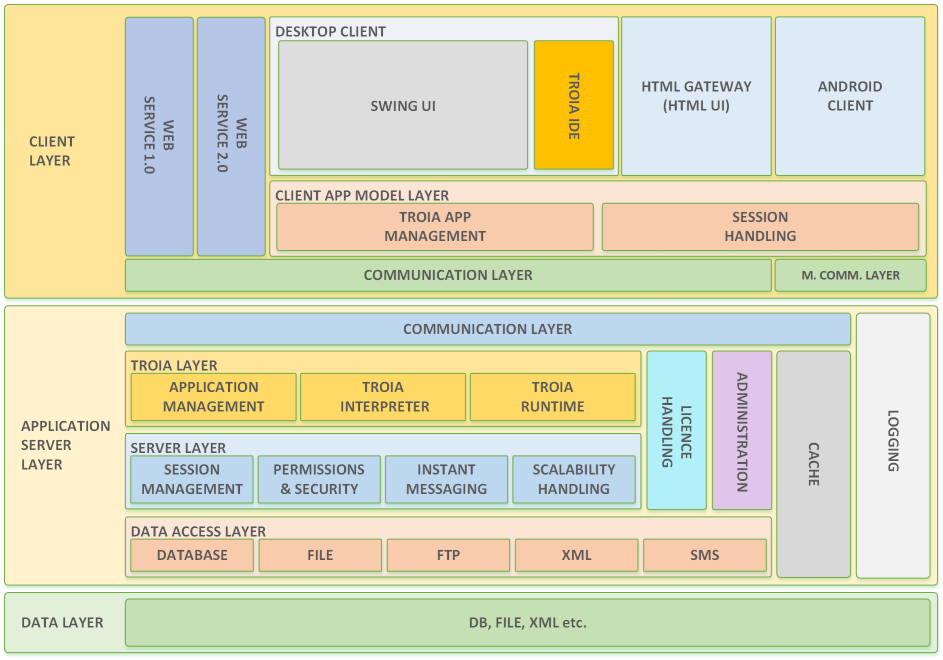

=======================
TROIA Platform Basics
=======================

*TROIA Platform is the software framework which TROIA Programming Language works on. This section introduces main components and architecture of TROIA Platform for better understanding of next sections.*

#troia platform purpose

History
--------------------

#history of troia platform

Platform Overview
--------------------

   
Basic Components
----------------

Application Server
==================

#application server

Client(s)
=========

#client

Licence Server
==============

#licence server

Load Balancer
=============

#load balancer

RMI Registry
============

#rmi registry

Other Components
================

#other compoenents

Platform & Programming Language
-------------------------------

#programming language

