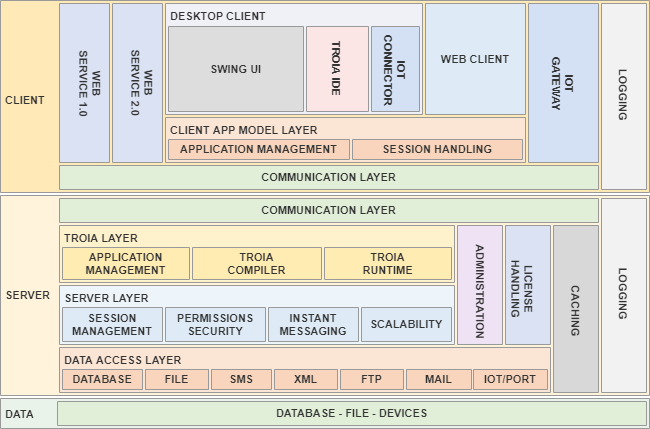

=======================
Platform Basics
=======================

*TROIA Platform is the software framework which TROIA Programming Language works on. This section introduces the platform and its main architecture of TROIA Platform for better understanding of next sections.*

Understanding the Purpose
=============================

TROIA is a high level programming language which is designed by IAS (Industrial Application Software). 

It's main purpose is for developing and maintaining business applications in an easy and efficient way. As a fourth generation programming language (4GL), TROIA has strong abstraction from all hardware specific details, bytes and bits etc. It has strong ability to operate large collections of information, in a programmer-friendly manner.

What Does The Platform Offer?
=============================

TROIA contains too many useful features to access, operate and report business layer information. Thanks to these features, TROIA reduces "the pain" caused by technical details of programming languages, so programmers can focus business layer issues. APIs&dlls, localization, supporting various platforms and databases are just the examples of these painful technical details. Here are some basic advantages that the platform offers for developers, administrators and the users:

**Free of Technical Details** 

It has a structure that is easy to learn and resembles a natural speech language. Employees without a software and computer engineering background can learn quickly. They can install, configure and develop.

**Rapid Development and Maintenance**

It has been developed with the aim of improving business processes and includes the tools needed for this purpose. Developers can focus on business processes rather than technical details they will encounter, and can carry out development and maintenance jobs more quickly and efficiently.

**Integrated Structure**

It is designed for the development of direct business applications. In this sense, it includes all structures and subsystems that may be needed. It largely eliminates the need for third party systems and programming languages. Training, support, maintenance and inter-system integrations are easily carried out within a system with the same approach.

**Cross Platform (Platform Independent)**

Application server and desktop client (native, desktop client) run on operating systems such as Windows, Linux, Unix. Web client-based client (web client) can be used over various internet browsers such as Chrome and Safari. All applications written on caniasERP and TROIA platform can run on all systems supported by the platform without the need for an additional process.

**Cross Database (Database Independent)**

All applications on the platform are compatible with all frequently used database systems such as MSSQL, MySQL, PostgreSQL, Oracle, DB2 and all other database systems that can be accessed with the JDBC interface without any changes in their codes.

**Compatible with Emerging Systems**

When the platform provides the newly released system, all applications written on it become running on this system without the need for a special compilation or conversion. The permanence of the investment made in the written applications is ensured.

**Multi-Language Support, Time Zone Support and Localization**

The TROIA Platform offers a variety of infrastructures ready to developers. Even a business application that can be developed on the platform in minutes includes language support, time zone and all other localization features.

**Customize Without Recompilation**

There is no need to recompile or translate the system in order to run written applications or make changes to existing applications. It enables application development with libraries, .dll, .jar files, modules, complex compilers without wasting time.

**Easy to Customize Without Editing Standard Source Codes**

The TROIA platform comes with a "use x instead of y" definition feature called cross in its structure. The Cross structure allows the use of a customized version instead of a standard class. Thus, unlike classical programming languages, you can change the behavior of the class without changing the points where objects of this type are created or the references accessing them. Cross definitions can be made not only for classes but also for dialogs, components, reports, so it is possible to adapt not only the behavior but also the screen views and outputs. Cross definitions; It can be done on the basis of user, user profile and / or whole system.

**Easy to Integrated with Other Systems**

One of the strengths of the Troia Platform is its flexibility and ease of integration. Within the details of the technologies and protocols to be used in integration, there are various integration options from automation systems, mail servers, telephone exchanges to ftp servers without wasting time.

**Highly Scalable Infrastructure**

Theoretically, hundreds of application servers working in cooperation with each other can work in parallel. With the help of the load balancer in the structure of the platform, users can be directed to the most suitable servers by taking into account the instant load distribution or various parameters. All applications developed using the TROIA Platform can serve one or thousands of users on this scalable structure without a significant performance difference.

**Easy Installation, Management and Monitoring**

System setup and update processes can be carried out with simple file copying operations or can be automated according to the need. Management and monitoring tools come ready-made with the TROIA platform and are in parallel with the other components of the system. Even, thanks to the various system functions, existing vehicles can be adapted and new ones developed using the TROIA language.

Main Components
===============

Application Server
------------------

Application server is one of the most important components of TROIA platform. As it is obvious, it is a server side service that serves for all kind of TROIA clients. Basically application server is responsible for user session management, handling troia application lifecycle, database transaction management etc. 

The most important responsibility of application server is running TROIA programming language and handling troia application lifecycle. **Application server is the only platform component that is able to run TROIA codes.** Therefore it is not possible to run a troia code without an application server.

A single application server is able to serve multiple clients. User count that an application server is able to serve properly depends on the workload of application server. It is possible to run multiple servers simultaneously to server for numerous concurrent users. 

Client(s)
---------

It is not possible to log in an application server and run a troia application directly on application server. To do this operations you need a TROIA client. Most used TROIA client is desktop client (also called java client or swing client) that is able to connect application server and draw troia applications on user interface. The main functionality of this client is getting user actions passing them to application server and drawing resulting screen to user interface. Additionally, development environment of TROIA Language is a part of java client, in other words to develop a TROIA Application you have to connect application server via a desktop client.

There are different kind of clients such as desktop client, web client and web services. Clients are not able to run TROIA codes, their basic responsibility is transferring user interactions to server and handling application server response in ui or presentation layer.

License Server
--------------

License Server, a server side service that handles licencing issues considering user count and modules (TROIA Application groups). In general, License Server serves for application servers, although some other server side components needs license server.

After its launch, an application server tries to access License Server at first login attempt. If your License Server is down or not accessible, application servers do not allow users to log in. If license server gets down while application servers have already logged users, this users can work properly. But it is not possible to log in new users until your application server access license server.

To serve properly, license server and the application servers that it serves for must have same version.

RMI Registry
------------

RMI Registry is a server side service that provides a communication infrastructure between all components of TROIA Platform. RMI Registry uses RMI Infrastructure of java which provides communication method for different java applications. Any two components of the platform uses RMI Registry (server to server, client to server, server to license server etc), so running a single RMI registry is a must to run other platform components properly.

Other Components
----------------

Although most important tools and components are listed above, TROIA Platform has other components for load balancing, administration, single sign on, monitoring, SMS handling etc. Some of this components are listed below:

**Load Balancer** is a server side service that redirects clients to best available server considering server resources and the rules that are defined its configuration.

**SSO Gateway** is a server side service that provides single sign on options for TROIA Platform users.

**SMS Gateway** is another server side service for handling SMS handling.

**IOT Gateway** is a service that communicates with iot devices through various protocols and passes events to application server considering its configuration. Even if it is a server side service, it is a kind of client of application server.

**Workbench** is an administration tool(a kind of client) to manage and monitor server side components such as application server,license server,load balancer. Using this tool system administrators can view and manage application server cache, users sessions and their running applications etc.

**System Reporter** is a tool that reports status of your server side components in a configurable period.

Network Architecture Overview
=============================

Here is an overview of all TROIA Plaform's main components and network structure from database to user interface. This overview clearly shows which components of TROIA Platform are server or client. Additionally, it is possible to see, directions of communication lines. Understanding this structure is too important to overcome some advanced questions about platform by yourself.

   
Please discuss question below considering the network structure:

::

	Is it possible to push an information to client side 
	    when an instant message recieved from another user?
		
Configuration Basics
====================

Database Configurations
-----------------------

Database server and port configuration is located on your databasesettings.ias file or [Database] section of your server settings files. TROIA Platform does not force an exact db vendor or port number etc., it totally depends on your needs and security policies. But in any case your database servers must be accessible from your application servers.

Application Server / Load Balancer / RMI Registry Configurations
----------------------------------------------------------------

System does not use a specific port, it totally depends on your needs and security policies. It is also possible to define multiple port for an application server, all these port configuration is located on [Network] section your server settings file. 

Additionally, server settings file contains rmi registry port number configuration (RMIRegistryPort), this is the port number of your RMI Registry which is another server side component for communications between clients and all server side components.

The most important thing is that "your server must be accessible from license server, load balancer, end user desktop computers, server side devices that your batches work on and web server that serves TROIA Platform's web client. So please be sure that your rmi registry port is accessible from all license server, load balancer, client devices, batch application servers and your web server. Moreover, application server ports must be accessible considering their purposes (some servers may be internal only, for batches only etc.)

Load Balancer configuration is very similar to your application server and has same kind of network configuration to make it accessible by clients. Port number is not constant, it is configurable and also possible to add multiple ports on load balancer settings file. Load balancer must be accessible by client computers and also from web server.

License Server
--------------

Licence Server registers itself to the RMI Registry that runs on 1099. It has also its own communication port which is confirable by "internalrmiport" application parameter. These two ports must be accessible by application servers. ("internalrmiport" parameters is supported by the builds after 25.07.29-01, before this version this port is defined randomly on runtime) 

Web Server
----------

Web server; hosts TROIA Web Services, Web Clients, JNLP Files and some minor components of TROIA Platform. Tomcat is the most popular and widely used web server that is used for serving troia web components. There is not constant port, it is configurable (mostly default tomcat port is used) and it depends on your needs. But at the and of the day your tomcat must be accessible by all your client computers (to browse jnlp or web client)

Software Architecture Overview
==============================

Basically, TROIA Platform allows programmer to develop applications that access data, manipulate it and save. To understand platform architecture its very important to understand the roles of application server and client(s). The graphic below, shows the main structures and layers of TROIA Platform from user interface to data. Also, it's possible to understand responsibility/functionality share of application server and client. 

   
Understand the roles of each component and their subsystems using this graphic and try to create some statements and discuss them for better understanding. Here are some sample statements to discuss:

::

	- TROIA Codes are executed only in application server.
	- IDE is a part of desktop client, 
		so TROIA applications are only developed desktop devices.
	- Desktop and web shares same troia application model layer.
	

Major Builds of TROIA Platform
==============================

Builds numbers are listed below:

::

	3.08.xx xxxxxx   (2006) (compatible with 6.02 CANIAS ERP version)
	5.01.xx xxxxxx   (2011) (compatible with 6.03 CANIAS ERP version)
	5.02.xx xxxxxx   (2014) (compatible with 6.04 CANIAS ERP version)
	8.02 YY.MM.DD-NN (2018) (compatible with 8.02 CANIAS ERP version)
	8.03 YY.MM.DD-NN (2020) (compatible with 8.03 CANIAS ERP version)
	9.03 YY.MM.DD-NN (2023) (compatible with 9.03 CANIAS ERP version)
					 
	     YY.MM.DD.NN (compatible with all 8.02, 8.03, 9.03 CANIAS ERP versions)

How to Follow Changes & Improvements?
-------------------------------------

Each build of TROIA Platform fixes some bugs or reveals some new features in different layers. In some cases, build upgrade requires some manual operations by administrators or developers. So you need to follow changes between builds. All changes are listed in ReleaseNotes.txt document which is supplied/distributed with each build. Also it is possible to read release notes document from "SYST17 - Release Notes" TROIA application and "Relese Notes Analyser" tool on Workbench.

