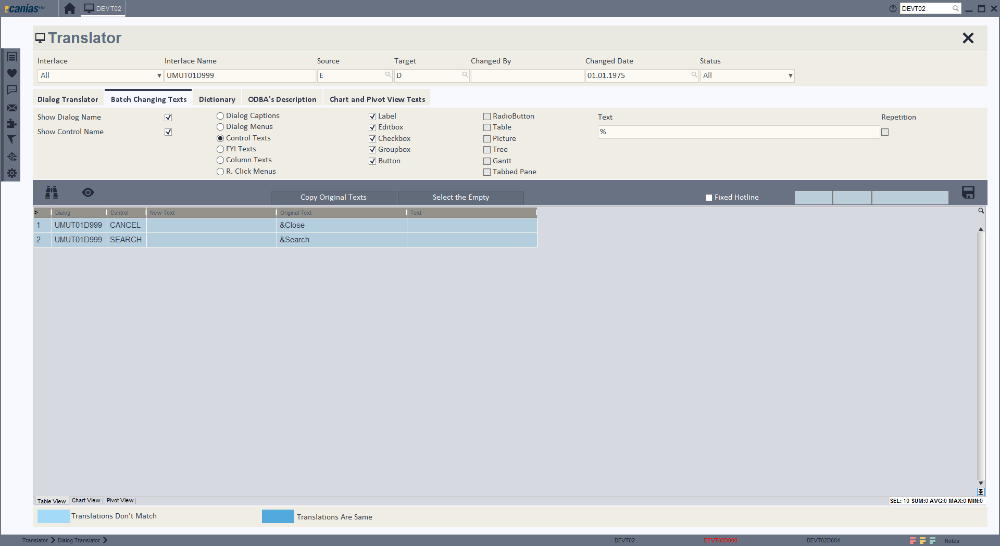
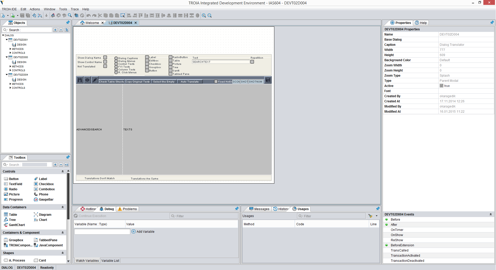

=======================
Language Basics
=======================

*This section aims to introduce concepts and key terms of TROIA Programming Language. Most of subtopics will be discussed in detail in next chapters.*

Basic Language Elements
--------------------

Class
====================

TROIA is an object oriented language, so it allows programmers to define classes to perform a task or model a business entity.
Like any other object oriented language, classes have members and methods and they support inheritance and encapsulation.

Although TROIA classes able to model any kind of business entity and its behaviours, classes are usually used as a set of methods as a TROIA programming convension.
TROIA Programmers usually use tables to store an entity's fields because of advantages of using tables.

Dialog
====================

Dialog is a **user interface form** designed to perform a task on, like a web form or a swing dialog.
Usually, dialog is a combination of simple or complex TROIA controls such as textfields, buttons, comboboxes, checkboxes, tables, charts etc.

Dialogs have methods similar to classes, so TROIA programmers define and call methods on dialogs.
Additionally they have predefined events. Events are TROIA methods which are called by TROIA runtime when a specific action performed like "form load", "button clicked" etc.

Report
====================

Reports are similar items to dialog, whose ui output can be redirected to a PDF file, text file or printer. Like diailogs, they have predefined events and also support defining and calling methods.
Report also has controls such as labels, symbol fields, images,barcodes, shapes etc, and they are desinged in a graphical user interface.

Transaction
=========================

Transaction is simply a database record that defines a standalone TROIA application.
The main attributes of a transaction are name, description and start dialog.

When you call/start a transaction, start dialog of this transaction is opened automatically.

Some Key Terms
--------------------

Trace
=========================

Trace is file that contains log records of running TROIA code. Using traces, developers are able to review whole flow after code executed.

Creating trace is optional and it depends on a simple configuration which is set on runtime, so programmers do not need to build their application in release or debug mode. It is also possible to get trace in productive environments.

As default, users are not allowed to create trace files, to access trace on/off ui items user must have "TRACE" permission. Trace files can be read/managed/downloaded from server using TROIA IDE trace tool or 'DEVT31 Trace (Files)' transaction.

Although TROIA Interpreter also supports debugging, TROIA developers usually use traces to detect and fix bugs of TROIA Applications.

Convert/Save
====================

In TROIA, coverting is parsing and compiling a TROIA item such as dialog, report, class. In this process, TROIA codes are transformed into a binary form that can be executed by TROIA Interpreter and this binary information is stored temporarily. 

Convert process is related about TROIA code and it's flow, so it is totally language independent. **It is obvious that, if TROIA code contains parse errors, system can not create binary codes so convert operation fails.**

Save process is performed after converting,in this stage binary codes are consolidated with language elements and resulting content is written to files with '.dlg' & '.cls' extensions. 
A '.dlg' is a ready to run binary file that contains all information about a TROIA dialog (&report&component) such as controls, events, methods etc.  '.cls' file is similar, but its for TROIA classes.

Development Tools
--------------------

TROIA IDE
====================

**TROIA IDE** is the primary development tool of TROIA Platform. It's main functionality is defining/modifying TROIA items such as dialogs, classes, reports etc.
Additionally, it contains useful tools such as optimization tools, code comparing tools, import/export tools etc.

To open TROIA IDE, click **"MENU > TROIA"** IDE menu item which is invisible as default. 
There are two access levels to TROIA IDE, first one is "read-only" which allows users only read/view existing TROIA items and codes.
Second one is read-write which allows create/modify TROIA codes and items. "TROIA IDE" menu is only visible for users which has one of this access rights.

+------------------+-----------------------------+
| **IDE Access**   | **Permission***             |
+------------------+-----------------------------+
| No access        |                             |
+------------------+-----------------------------+
| Read-Only        | DEVELOPMENT(READ-ONLY)      |
+------------------+-----------------------------+
| Read-Write       | DEVELOPMENT                 |
+------------------+-----------------------------+

(*) Permissions will be discussed in detail on next chapters.

SYS & DEV Transactions
=========================

Although most of operations about TROIA development can be performed on TROIA IDE, there are useful tools which is implemented using TROIA.

Most used TROIA Applications are listed below, for all applications please check all transactions that starts with SYS and DEV prefix. (SYS & DEV Modules)

+----------+-------------------------------+----------------------------------------------------+
| **Name** | **Description**               | **Note**                                           |
+----------+-------------------------------+----------------------------------------------------+
| SYST00   | System Transactions & Gadgets |                                                    |
+----------+-------------------------------+----------------------------------------------------+
| SYST01   | System Locks                  | also an TROIA IDE tool                             |
+----------+-------------------------------+----------------------------------------------------+
| SYST02   | System Messages               |                                                    |
+----------+-------------------------------+----------------------------------------------------+
| SYST17   | Release Notes                 |                                                    |
+----------+-------------------------------+----------------------------------------------------+
| DEVT01   | Database Browser (ODBA)       | also available on TROIA IDE for limited operations |
+----------+-------------------------------+----------------------------------------------------+
| DEVT02   | Dialog Translator             |                                                    |
+----------+-------------------------------+----------------------------------------------------+
| DEVT04   | Dialog-Tools                  |                                                    |
+----------+-------------------------------+----------------------------------------------------+
| DEVT06   | Hotline Management            |                                                    |
+----------+-------------------------------+----------------------------------------------------+
| DEVT07   | Search on Codes               | also an TROIA IDE tool                             |
+----------+-------------------------------+----------------------------------------------------+
| DEVT11   | Runcode Test Transaction      |                                                    |
+----------+-------------------------------+----------------------------------------------------+
| DEVT31   | Trace (Files)                 | also an TROIA IDE tool                             |
+----------+-------------------------------+----------------------------------------------------+
| DEVT40   | Execute SQL                   |                                                    |
+----------+-------------------------------+----------------------------------------------------+

Hotline
------------------------

Hotline is "Change Request" in TROIA Platform. Hotlines are created/managed on 'DEVT06 Hotline Management' transaction (application) and they are stored in database.

It is not allowed to change any TROIA Item(dialog, class etc.) without a change request. 
All development tools ask programmer to select hotline before modification and modifications are logged related with selected hotline.

Comments in TROIA
-------------------------

TROIA supports several ways of commenting:

Syntax for single-line comments:

::
	
	#this is a single line comment
	RESULT = THIS.CALCULATE(P1, P2);
	//this is a single line comment
	
	RESULT = RESULT * 3;

Syntax for multiple-line comments:

::
	
	RESULT = THIS.CALCULATE(P1, P2);
	
	/* 
	   first line of multiline comment 
	   second line of multiline comment
	*/
	RESULT = RESULT * 3;
	
