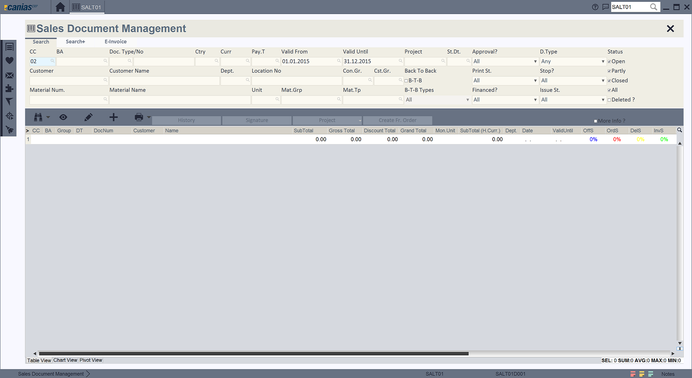
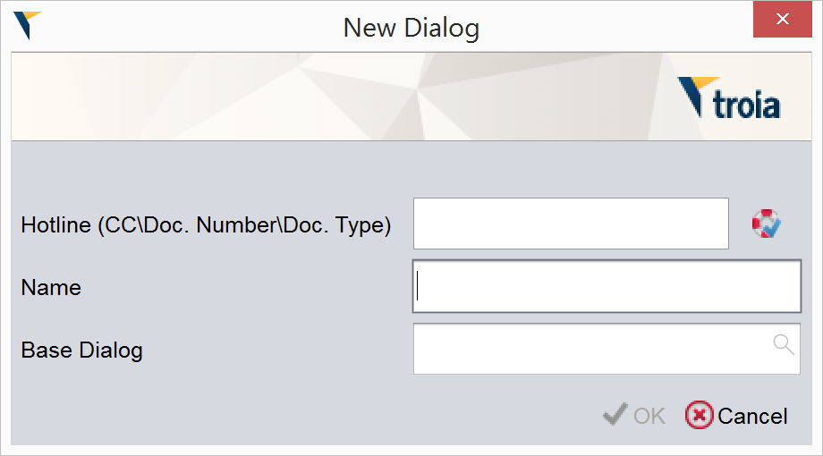
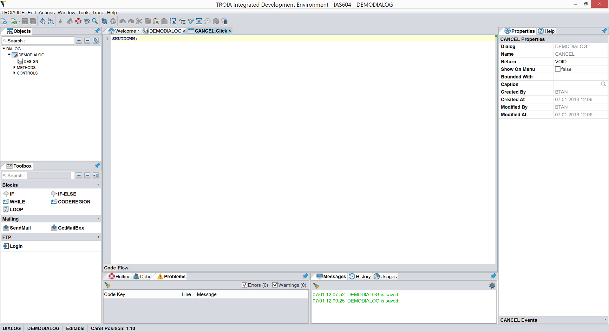

=============
Dialog Basics
=============

Introduction
------------

Dialogs are user interface forms that user can perform a specific task on. A dialog is consisted of it's basic dialog information, events/methods and the controls on it. "Basic information" is just its size, background color name and it is enough to define an empty dialog. 

The main components of a dialog are controls on it. Controls are simple items that is used for user interaction, such as buttons, textfields, comboboxes, graphics,tab panes, images etc. 

Also, It is possible to define methods on dialogs and call these methods from others to add behavior to dialogs. Some of this methods has special names and called by TROIA interpreter. These kind of methods are called "dialog events". We will discuss dialog events, all types control and their events in next sections. 

Creating/Editing Dialogs
========================

TROIA IDE is used to create/edit TROIA dialogs. To open TROIA IDE, you must click "TROIA IDE" item on top menu of java client. If there is not a TROIA IDE item on your menu please check your development rights which we discussed on previous sections.

To create a new dialog, you must click **TROIA IDE-> New -> New Dialog** on menu and fill the new dialog form.

   
In new dialog form you, must select a hotline (change request) and enter a valid dialog name. A valid dialog name must be unique and at least four characters length, so you can not create a new dialog whose name is shorter than four characters or same with an existing dialog.

The last field in new dialog form is "Base Dialog". It is possible to inherit dialogs, so if your dialog has a base dialog you must enter/select the name of base dialog. For now, we can leave "Base Dialog" field empty, we will discuss inheritance in next sections. 

After you click "OK" button on new dialog form, IDE creates a new dialog and opens design window.

How Dialogs are Stored?
-----------------------

All development information (codes, design etc) about dialogs are stored in database tables.

+-----------------+-------------------------------------------------------+
| SYSDIALOGS      | Stores dialog information such as size, name etc.     |
+-----------------+-------------------------------------------------------+
| SYSDLGTEXTS     | Stores caption of dialog related with language.       |
+-----------------+-------------------------------------------------------+
| SYSDLGCODES     | Stores events & methods of dialog and dialog controls |
+-----------------+-------------------------------------------------------+
| SYSDLGFUNCTEXTS | Strores the caption of methods related with language. |
+-----------------+-------------------------------------------------------+
| SYSCONTROLS     | Stores control information such as size, position etc.|
+-----------------+-------------------------------------------------------+
| SYSCTLTEXTS     | Stores captions of controls related with language.    |
+-----------------+-------------------------------------------------------+

Binary Format of Dialogs
-------------------------

With "Convert" operation, binary/compilation data is built. This data contains all kinds of dialog information such as name, size, controls, control positions, functions and events etc. 

"Save" operation writes binary data and dialog texts on given language to a ".dlg". It is obvious that dialog files are language dependent because they contains dialog and control texts for a languge.

Dialog files are stored in a folder named **user file path**. User file path is the folder that user loads all binary information(dialog, class, report) and it is configured for each user on SYST03. Here is the format and location of dialog file.

::
	
	format : {userfilepath}\jdlg\{module}\{languagecode}{dialog}.dlg
	
	Example:
	SALT01D001 in English> {userfilepath}\jdlg\SAL\ET01D001.dlg
	SALT01D002 in Deutsch> {userfilepath}\jdlg\SAL\DT01D002.dlg

System reads dialog file when dialog is opened. On runtime system does not access development tables. 

Basic Dialog Events
--------------------

Events are predefined methods that called by system automatically when a specific action occurs. For example; "button clicked" is an event called automatically when user click a button.
Programmers must implement the event to do something on related action occurs.

Here is the most used events of dialogs:

+--------+---------------------------------------------------------------------------------+
| BEFORE | First event on dialog open, fired after controls defined (dialog is not visible |
+--------+---------------------------------------------------------------------------------+
| AFTER  | Fired after "BEFORE" event, dialog is still not visible.                        |
+--------+---------------------------------------------------------------------------------+
| ONSHOW | Fired after "AFTER" event, when dialog is visible on user interface.            |
+--------+---------------------------------------------------------------------------------+

In some cases, programmers may need calling dialog events manually. Calling a dialog method is not different from calling a dialog method.

::

	THIS.AFTER();
	THIS.ONSHOW();

Additionally, dialogs have ONTIMER, TRANSCALLED, BEFOREEXTENSION events which are called for some specific actions. This events will be discussed on related sections.

Basics of Controls
-------------------

Controls are the ui items such as buttons, textfields, comboboxes etc. Programmers define appropriate controls on dialogs to create interaction with user. All controls have predefined events which is called by interpreter when user performs a specific action like clicking button or changing value of a textfield. A dialog control is defined by two main features its type and subtype and both of type and subtype information is stored on SYSCONTROLS table. "Type" defines the main group of control (button or textfield). "Subtype" changes only one or two features control such as event count, appearance,  symbol type etc.

To define a control on a dialog, programmer drags required control from "Toolbox Explorer" to dialog and modifies control features due to process thas imlemented.  Location, size, visibility, disable/enable, background color, foreground color are the main and common features of all type of controls. Additionally, each control type has its own features. It is possible to modify control features using "Property Explorer" and TROIA code due to workflow.  Here is a new button control and its events and features:

.. figure:: images/dialogbasics/newdialogcancelbutton.png
   :width: 700 px
   :target: images/dialogbasics/newdialogcancelbutton.png
   :align: center
   
To add behaviour to defined control, programmer must implement one or more events of control. Each control type has also its own events. ,They are listed in right click menu on dialog design screen and at the bottom of "Property Explorer" (when control selected).

Sample Control: TextField
=========================

Subtypes of TextField

Color
Custom Editor
Date
Date Time
Decimal
Duration
Editor
Factor
File Chooser
HTML
HTML Viewer
Integer
Link
Long
Money
Password
Percent
Phone
Rich Editor
Quantity
Text
Time
Times
TroiaEditor
IconChooser

Here is the basic events of a textfield.

+-----------------+-------------------------------------------------------+
| Event           | Description & Event Fire                              |
+-----------------+-------------------------------------------------------+
| GainFocus       | When user focuses on a textfield.                     |
+-----------------+-------------------------------------------------------+
| LoseFocus       | When user focuses on another control after textfield. |
+-----------------+-------------------------------------------------------+
| TextChanged     | If user changes value of textfield, before LoseFocus. |
+-----------------+-------------------------------------------------------+

Textfields also have additional events named ZoomBefore/ZoomAfter, Drag/Drop and RightClickMenu events. We will discuss this kind of event in next sections. 

Switching Between Dialogs
-------------------------

There are two main methods of opening dialogs. First one is defining a dialog as start dialog of a transaction (application). In this method system automatically calls start dialog when transaction opened. We will discuss how to define a transaction and a start dialog in next section.

Second method is calling a dialog via TROIA codes. To call a dialog using TROIA, "CALL DIALOG" command is used. For example, if we want to call a dialog when user clicks a button on our first dialog we must implement "click" event and write a CALL DIALOG command. After CALL DIALOG is executed system opens new dialog fires its events and switches to second dialog.

Its possible to call dialogs as popups. Here is the syntax alternatives for CALL DIALOG command:

::

	CALL DIALOG {dialog};
	CALL DIALOG WITH LOCATION {x}, {y} SIZE {width}, {height};
	

**CALL DIALOG command stops code execution on running method and opens new dialog on client, remaining part of caller method executed after dialog close** (like calling a function that has a user interface).

To close a dialog, you must use SHUTDOWN command. SHUTDOWN command closes the last opened dialog and switches to previous dialog. If the closed dialog is the last dialog of transaction system closes transaction automatically.

::

	SHUTDOWN;
	
In TROIA, transferring a value or variable to dialogs does not require an extra effort, in other words you can access the values of control symbols which are defined by previous dialog. This is totally about "scope". If you don't understand what the scope is or how system works please review related sections.

Scope and Transferring Data Between Dialogs
-------------------------------------------

Functions & Right Click Menu
----------------------------
right click menu.

Sample 1: Counting Words
------------------------

sample.