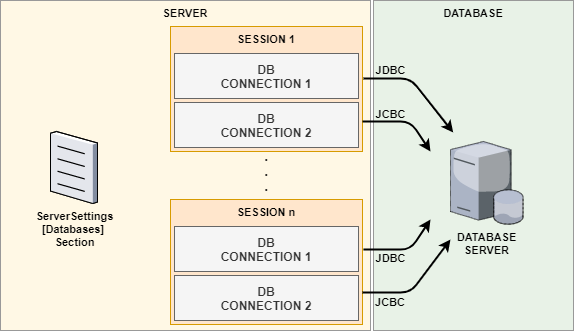

====================
Database Connections
====================

*TROIA Platform establishes a database connection while logging in to manage TROIA level database operations. Moreover, it is possible to establish and manage multiple database connections for multi-database operations such as data transfer between different database systems with TROIA. This section aims to explain how to work with multiple databases and manage db transactions.*

Basics of DB Connection In TROIA
--------------------------------

---------------------------
DB Configurations and Login
---------------------------

Database configurations and database related login parameters are not directly related to TROIA Programming. But it is important to understand the whole process of database connection. The information of all database connections that can be made through the application server are defined in the [Databases] section of server configuration (settings) file. Each connection information has an unique id that distinguishes it from the other. This id consists of two parts, DBServer and DBName. 

When a user logs in the system, system firstly finds database configuration using DBServer and DBName parameters from user's login parameters and then uses this configuration for database connection.

---------------------------
Default DB Connection
---------------------------

Application server establishes two different database connections to same database using same configuration. Therefore; in ordinary cases, TROIA programmers do not need to make any operation to connect database to run queries, it automatically gets ready for TROIA programmers use without any TROIA level effort. It is also same for closing these connections, it is totally handled by the interpreter and closed while user logging out.

This two connections are called "first database connection" and "second database connection" in TROIA terminology (jargon) and they have different purposes. First database connection is assigned to TROIA operations. In other words if your application contains a SELECT statement, system runs select query using first database connection. All TROIA level SQL commands uses first database connection. 

Second database connection is assigned for interpreter level database operations like inserting logs, gathering transaction's first dialog etc. It is not possible to run data manipulation (SELECT, UPDATE, INSERT, DELETE) and data definition (CREATE, ALTER etc.) queries using second database connection, but some some special troia commands like ENQUE, DEQUE. Therefore you can just ignore second database connection as a TROIA programmer.

--------------------------------
DB Connection Belongs to Session
--------------------------------

As you may predict, **database connection is a property or feature of user's session**, so even if user opens more than one transaction all transactions uses same database connection. This means database connection is shared by all open transactions, and if a session changes state or a feature of connection this state/feature is valid for other transactions. Actually this is one of the main technical reasons of why it is not possible to run more than one processes on different transactions simultaneously. For some special cases like multithreading, it is possible to establish dedicated database connections for each transaction. We will discuss this advanced issue in next sections, but for now you can just ignore dedicated database connections for transactions.

Briefly, system automatically establishes a database connection on user login to serve for all open TROIA applications and all SELECT, UPDATE, INSERT and DELETE commands uses this database connection.

Connecting Different Databases
------------------------------

To perform database operations on a database other than default connection you have to establish a custom database connection. In this case connect and disconnect operations are performed by TROIA Programmer, so **closing connection after db operations is in the responsibility of TROIA code**.

To connect a database you can use MAKENEWCONNECTION command, and CLOSECONNECTION command to close database connection. As you may predict, MAKENEWCONNECTION command gets the id of the 
database configuration line and a name for the new connection. CLOSECONNECTION command gets only connection name to close connection. Here are the basic syntaxes of the commands.

::
	
	MAKENEWCONNECTION {connectionname} {user} {passw} {dbserver} {dbname};
	CLOSECONNECTION {connectionname};
	
	//{user} and {passw} parameters are totally ignored, they are just for backward compatibility.
	//{dbserver} and {dbname} are used to match a db configuration line in server config file.
	
It is also possible without defining a database configuration with additionaly syntaxes of MAKENEWCONNECTION, but in this book we will totally ignore this option, for more information please see help documents of TROIA. Both commands sets SYS_STATUS and SYS_STATUSERROR if they encounters a problem while connecting and disconnecting process. 

::
	
	OBJECT: 
	 STRING CONNECTIONNAME;

	CONNECTIONNAME = 'NewConnection';
	MAKENEWCONNECTION CONNECTIONNAME XXX XXX DBSERVER1 ARCHIVEDB;

	IF SYS_STATUS THEN
		STRINGVAR3 = SYS_STATUSERROR;
	ELSE
		STRINGVAR3 = 'ok.';
		SETACTIVECONNECTION CONNECTIONNAME;
		/**/
		SELECT * FROM USERACCOUNTS INTO ACCOUNTS;
		/**/
		SETACTIVECONNECTION DEFAULT;
	ENDIF;

	CLOSECONNECTION CONNECTIONNAME;

	SET TMPTABLE TO TABLE TMPTABLE;
	STRINGVAR3 = SQL;

Managing DB Transactions on Mulptiple Connections
-------------------------------------------------

Dedicated Database Connections for Transactions
-----------------------------------------------

...

