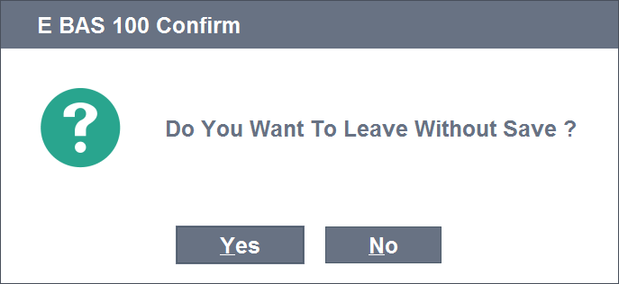

===================
Messages and Alerts
===================

MESSAGE Command
---------------

Programmers use popup messages to inform users or get some critical data such as confirmation, selecting an option etc.

To show such messages in TROIA, "MESSAGE" command is used. MESSAGE command gets some parameters that defines the message instead of message text's itself (because of multi language support). Here the basic syntax of MESSAGE command and sample code that shows messagebox above:

::
	
	MESSAGE {module} {messagetype}{messageid} WITH {inputparamsformessagetext};
	
	/* sample code, there is not any %s in message text, 
	so there is not a paremeter after WITH keyword	*/
	
	MESSAGE BAS C100 WITH;
	
This syntax is simples and most used syntax of MESSSAGE command, for more details such as options and default option please see related help documents.

Message texts are defined in "SYST02 - System Messages" transaction using message definition parameters. This parameters are the module of messsage and an message id which is simple long number. MESSAGE command finds the appropriate message text and options using module, id and user's login language. 

In "SYST02 - System Messages" transaction, it is possible to define message texts and options in multiple languages. Message texts can contain '%s' string formatting character for the parameters which will be provided on runtime using WITH keyword on MESSAGE command. Also it is possible to define indexes for text parameters like '%s1', '%s2' for if the word order changes language by language.

Message Types
=============

Message Type effects message appearence on user interface and the way how user will intract with message such as selecting an option, making a text input or just clicking ok button on an information message. All message types are listed below:

+-------------+--------+-----------------------------------+
| **Type**    |**Code**|                                   |
+-------------+--------+-----------------------------------+
| INFORMATION |   I    | Information icon on message popup |
+-------------+--------+-----------------------------------+
| ERROR       |   E    | Error icon on message popup       |
+-------------+--------+-----------------------------------+
| WARNING     |   W    | Warning icon on message popup     |
+-------------+--------+-----------------------------------+
| CONFIRMATION|   C    | Yes/No Questions                  |
+-------------+--------+-----------------------------------+
| OPTION      |   O    | Custom options                    |
+-------------+--------+-----------------------------------+
| PARAMETER   |   P    | User Keyboard Input               |
+-------------+--------+-----------------------------------+

Reading User Response & System Variables
========================================
CONFIRMATION, OPTION or PARAMETER message types, we need to read which option is selected or the text input by user. User response is set to CONFIRM and SYS_CONFIRMTEXT system variables, so programmers can read the value and do something due to user input. In confirmation messages, CONFIRM system variable is set to YES when user selects yes option, otherwise it is set to NO. 

::

	MESSAGE BAS C100 WITH;

	IF CONFIRM == 'YES' THEN
		STRINGVAR1 = 'User said: yes!';
	ELSE
		STRINGVAR1 = 'User said: no!';
	ENDIF;

In option messages, CONFIRM variable is set to an integer which shows the order of selected option and SYS_CONFIRMTEXT is set to text value of selected option.

Another system variable which is set on MESSAGE command is SYSMESSAGE. SYSMESSAGE is set to message text for programmers who need message text. Remember message text is calculated using given module, messageid, login language and applied message parameters. 

Code Breaking & Store
---------------------
code breaking

Some Factss About MESSAGE
-------------------------
- batch clients

- in sql transaction

Other Alerting Options
----------------------
alerting options.
