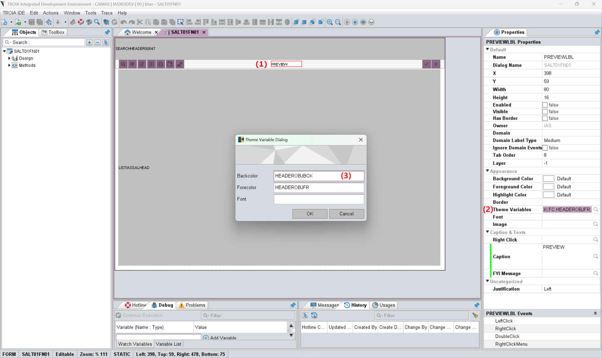

===========================
User Theme and UI Standards
===========================

*This sections aims to introduce details of user theme and ui development standards.*

What is User Theme?
--------------------

The theme is designed to provide the user interface with certain standards, in harmony but to offer various options to the end user in terms of the interface. It is the set of design elements that determine the overall appearance and style of the TROIA Client. The theme includes text colors, background colors, fonts, borders and general style rules.

The TROIA platform comes with a set of built-in themes. In addition, it is possible to make various changes to these standard themes or define new themes. You can use the SYST13 transaction to define new themes or modify existing themes.

How to Define a Custom Theme?
=============================

To define a new valid theme, you must create a new theme on SYST13 transaction and add all predefined theme variables with your own values. Theme variable concept and standart theme variable names will be discussed in this section. **If there is a missing default theme variable in your theme, it means that your theme is invalid.** Althought defining a theme is possible and easy, distrubuting and keeping it harmonious require some efford. So **it is not recommended that you take on such a responsibility unless you have enough resources or time to undertake such an effort on a long-term basis.**

Theme Variables
--------------------

A theme variable is a variable defined in theme, so its value can change depending on theme, but it is consistent inside a theme and harmonious. Therefore, all controls uses the same value defined in theme.

Developers can assign these variables to related control features. For example, a developer can set a theme variable control backcolor, like setting it to "red". And system reads actual background color from user theme and assingn to the control background. 

TROIA Platform contains some predefined theme variables for certain purposes. Here are the list of predefined theme variables and their type and purpose.

+--------------------+----------------+----------------------------------------------------------------------------------------------------------+
| BARBACKCOLOR       | Color          | Background color for the window header. (defines theme main color)                                       |
+--------------------+----------------+----------------------------------------------------------------------------------------------------------+
| BARFORECOLOR       | Color          | Foreground color for the window header.                                                                  |
+--------------------+----------------+----------------------------------------------------------------------------------------------------------+
| BBACKCOLOR         | Color          | Background color for the buttons.                                                                        |
+--------------------+----------------+----------------------------------------------------------------------------------------------------------+
| BBORDERCOLOR       | Color          | Border color for buttons.                                                                                |
+--------------------+----------------+----------------------------------------------------------------------------------------------------------+
| BBORDERS           | Border         | Button borders as string (sample:1111)                                                                   |
+--------------------+----------------+----------------------------------------------------------------------------------------------------------+
| BDBORDERCOLOR      | Color          | Border color for disabled buttons.                                                                       |
+--------------------+----------------+----------------------------------------------------------------------------------------------------------+
| BDFORECOLOR        | Color          | Foreground color for disabled buttons.                                                                   |
+--------------------+----------------+----------------------------------------------------------------------------------------------------------+
| BDICONCOLOR        | Color          | Disabled icon color, this value is used while loading disabled icons instead of #242838                  |
+--------------------+----------------+----------------------------------------------------------------------------------------------------------+
| BDISABLEDBACKCOLOR | Color          | Background color for disabled buttons.                                                                   |
+--------------------+----------------+----------------------------------------------------------------------------------------------------------+
| BFORECOLOR         | Color          | Foreground color for buttons.                                                                            |
+--------------------+----------------+----------------------------------------------------------------------------------------------------------+
| BHIGHLIGHT         | Color          | Highlight color for buttons (hover or mouse over color).                                                 |
+--------------------+----------------+----------------------------------------------------------------------------------------------------------+
| BHIGHLIGHTBORDER   | Color          | Border color for highlighted buttons, used when mouse is over the button).                               |
+--------------------+----------------+----------------------------------------------------------------------------------------------------------+
| BIBACKCOLOR        | Color          | Background color for iconified buttons.                                                                  |
+--------------------+----------------+----------------------------------------------------------------------------------------------------------+
| BICONCOLOR         | Color          | Icon color, this value is used while loading svg icons instead of #242838.                               |
+--------------------+----------------+----------------------------------------------------------------------------------------------------------+
| BIGCAPTION         | Font           | Regular font+3(size) for the data to be emphasized.                                                      |
+--------------------+----------------+----------------------------------------------------------------------------------------------------------+
| BIGCAPTIONB        | Font           | Regular font+3+bold for the data to be emphasized.                                                       |
+--------------------+----------------+----------------------------------------------------------------------------------------------------------+
| CHBACKGROUND       | Color          | Table column and row header background color.                                                            |
+--------------------+----------------+----------------------------------------------------------------------------------------------------------+
| CHFOREGROUND       | Color          | Table column and row header foreground color.                                                            |
+--------------------+----------------+----------------------------------------------------------------------------------------------------------+
| CHRTBACKCOLOR      | Color          | Backgroud color for the charts.                                                                          |
+--------------------+----------------+----------------------------------------------------------------------------------------------------------+
| CHRTFORECOLOR      | Color          | Foreground color for the charts.                                                                         |
+--------------------+----------------+----------------------------------------------------------------------------------------------------------+
| DBACKCOLOR         | Color          | Dialog background color.                                                                                 |
+--------------------+----------------+----------------------------------------------------------------------------------------------------------+
| DESCRIPTIONLABELFC | Color          | Foreground color for description fields, less emphasized compared to original data fields.               |
+--------------------+----------------+----------------------------------------------------------------------------------------------------------+
| DEVT40FONT         | Font           | Special font for code for code editors or console outputs.                                               |
+--------------------+----------------+----------------------------------------------------------------------------------------------------------+
| DGHEIGHTFACTOR     | String/Decimal | Datagroup height factor. Decimal value to resize data group heights.                                     |
+--------------------+----------------+----------------------------------------------------------------------------------------------------------+
| EBBORDERS          | Border         | Editor borders.                                                                                          |
+--------------------+----------------+----------------------------------------------------------------------------------------------------------+
| EFBACKCOLOR        | Color          | Textfield and editor background color.                                                                   |
+--------------------+----------------+----------------------------------------------------------------------------------------------------------+
| EFBORDERCOLOR      | Color          | Border color for textfields.                                                                             |
+--------------------+----------------+----------------------------------------------------------------------------------------------------------+
| EFBORDERS          | Border         | Textfield borders.                                                                                       |
+--------------------+----------------+----------------------------------------------------------------------------------------------------------+
| EFDBACKCOLOR       | Color          | Backgroud color for disabled textfields and editors.                                                     |
+--------------------+----------------+----------------------------------------------------------------------------------------------------------+
| EFDBORDERCOLOR     | Color          | Border color for disabled textfields and editors.                                                        |
+--------------------+----------------+----------------------------------------------------------------------------------------------------------+
| EFDFORECOLOR       | Color          | Foreground color for disabled textfields and editors.                                                    |
+--------------------+----------------+----------------------------------------------------------------------------------------------------------+
| EFFONT             | Font           | Default font for textfields, buttons and labels.                                                         |
+--------------------+----------------+----------------------------------------------------------------------------------------------------------+
| EFFORECOLOR        | Color          | Foreground color for textfields and editors.                                                             |
+--------------------+----------------+----------------------------------------------------------------------------------------------------------+
| GBBACKCOLOR        | Color          | Background colors for the groupbox and tabbed pane control.                                              |
+--------------------+----------------+----------------------------------------------------------------------------------------------------------+
| GBBORDERS          | Border         | Borders for the groupboxes.                                                                              |
+--------------------+----------------+----------------------------------------------------------------------------------------------------------+
| GBDTABBACKCOLOR    | Color          | Disabled tab bacgroud color for tabbed pane control.                                                     |
+--------------------+----------------+----------------------------------------------------------------------------------------------------------+
| GBDTABFORECOLOR    | Color          | Disabled tab foreground color for the tabbed pane control.                                               |
+--------------------+----------------+----------------------------------------------------------------------------------------------------------+
| GBFONT             | Font           | Groupbox header font.                                                                                    |
+--------------------+----------------+----------------------------------------------------------------------------------------------------------+
| GBFORECOLOR        | Color          | Foreground color for the groupbox heades.                                                                |
+--------------------+----------------+----------------------------------------------------------------------------------------------------------+
| GBSTABBACKCOLOR    | Color          | Background color of selected tab for the tabbed pane control.                                            |
+--------------------+----------------+----------------------------------------------------------------------------------------------------------+
| GBSTABFORECOLOR    | Color          | Foreground color for selected tab for the tabbed pane control                                            |
+--------------------+----------------+----------------------------------------------------------------------------------------------------------+
| GBTABBACKCOLOR     | Color          | Background color for enabled but not selected tabs of tabbed pane control.                               |
+--------------------+----------------+----------------------------------------------------------------------------------------------------------+
| GBTABFORECOLOR     | Color          | Foreground color for enabled but not selected tabs of tabbed pane control.                               |
+--------------------+----------------+----------------------------------------------------------------------------------------------------------+
| GBTBACKCOLOR       | Color          | Background color for groupbox headers (title background).                                                |
+--------------------+----------------+----------------------------------------------------------------------------------------------------------+
| HEADERBCK          | Color          | Dialog header background color.                                                                          |
+--------------------+----------------+----------------------------------------------------------------------------------------------------------+
| HEADERBRD          | Border         | All groupboxes named as "HEADER" must use this theme variable as background.                             |
+--------------------+----------------+----------------------------------------------------------------------------------------------------------+
| HEADERBTNBCK       | Color          | Background color for buttons on headers.                                                                 |
+--------------------+----------------+----------------------------------------------------------------------------------------------------------+
| HEADERBTNBRD       | Border         | Border for buttons on dialog headers.                                                                    |
+--------------------+----------------+----------------------------------------------------------------------------------------------------------+
| HEADERBTNDBCK      | Color          | Background color for disabled buttons on headers.                                                        |
+--------------------+----------------+----------------------------------------------------------------------------------------------------------+
| HEADERBTNDFC       | Color          | Foreground color for disabled buttons on headers.                                                        |
+--------------------+----------------+----------------------------------------------------------------------------------------------------------+
| HEADERBTNFR        | Color          | Foreground color for buttons on headers.                                                                 |
+--------------------+----------------+----------------------------------------------------------------------------------------------------------+
| HEADERFONT         | Font           | Dialog header font.                                                                                      |
+--------------------+----------------+----------------------------------------------------------------------------------------------------------+
| HEADERFR           | Color          | Dialog header foreground color.                                                                          |
+--------------------+----------------+----------------------------------------------------------------------------------------------------------+
| HEADEROBJBCK       | Color          | Background color for the non-button controls on header.                                                  |
+--------------------+----------------+----------------------------------------------------------------------------------------------------------+
| HEADEROBJBRD       | Border         | Borders for the non-button controls on header.                                                           |
+--------------------+----------------+----------------------------------------------------------------------------------------------------------+
| HEADEROBJFR        | Color          | Foreground color for the non-button controls on header.                                                  |
+--------------------+----------------+----------------------------------------------------------------------------------------------------------+
| MAINBORDERCOLOR    | Color          | Border color for main window parts, tables, charts and orher large components                            |
+--------------------+----------------+----------------------------------------------------------------------------------------------------------+
| MENUBACKCOLOR      | Color          | Background color for the menu.                                                                           |
+--------------------+----------------+----------------------------------------------------------------------------------------------------------+
| MENUFORECOLOR      | Color          | Foreground color for the menu.                                                                           |
+--------------------+----------------+----------------------------------------------------------------------------------------------------------+
| MENUTABBCOLOR      | Color          | Backgroud color for menu tabs.                                                                           |
+--------------------+----------------+----------------------------------------------------------------------------------------------------------+
| MENUTABFCOLOR      | Color          | Foreground color for menu tabs.                                                                          |
+--------------------+----------------+----------------------------------------------------------------------------------------------------------+
| MSGTBACKCOLOR      | Color          | Background color for message titles.                                                                     |
+--------------------+----------------+----------------------------------------------------------------------------------------------------------+
| MSGTFORECOLOR      | Color          | Foreground color for message titles.                                                                     |
+--------------------+----------------+----------------------------------------------------------------------------------------------------------+
| MUSTFIELD          | Color          | Mustfield background color.                                                                              |
+--------------------+----------------+----------------------------------------------------------------------------------------------------------+
| PBACKCOLOR         | Color          | Background color for the picture control.                                                                |
+--------------------+----------------+----------------------------------------------------------------------------------------------------------+
| PBFORECOLOR        | Color          | Foreground color for the progressbar control.                                                            |
+--------------------+----------------+----------------------------------------------------------------------------------------------------------+
| RESIZETABLEFONT    | Integer        | Integer value that shows font resizing strategy for tables.                                              |
+--------------------+----------------+----------------------------------------------------------------------------------------------------------+
| SBACKCOLOR         | Color          | Bakground color for shape controls.                                                                      |
+--------------------+----------------+----------------------------------------------------------------------------------------------------------+
| SELECTIONBCK       | Color          | Background color for selected texts, rows and items.                                                     |
+--------------------+----------------+----------------------------------------------------------------------------------------------------------+
| SELECTIONFR        | Color          | Foreground color for selected texts, rows and items.                                                     |
+--------------------+----------------+----------------------------------------------------------------------------------------------------------+
| SFBACKCOLOR        | Color          | Background color for the labels.                                                                         |
+--------------------+----------------+----------------------------------------------------------------------------------------------------------+
| SFFORECOLOR        | Color          | Foreground color for the labels.                                                                         |
+--------------------+----------------+----------------------------------------------------------------------------------------------------------+
| SFORECOLOR         | Color          | Foreground color for the shape control.                                                                  |
+--------------------+----------------+----------------------------------------------------------------------------------------------------------+
| SLINEWEIGHT        | Integer        | Line weight for shape controls.                                                                          |
+--------------------+----------------+----------------------------------------------------------------------------------------------------------+
| SMALLCAPTION       | Font           | Regular font-3(size) for the sub information or less emphasized info.                                    |
+--------------------+----------------+----------------------------------------------------------------------------------------------------------+
| SMALLCAPTIONB      | Font           | Regular font-3+bold for the sub information or less emphasized info.                                     |
+--------------------+----------------+----------------------------------------------------------------------------------------------------------+
| SUBHEADERFONT      | Font           | Header font size -3 font for sub headers.                                                                |
+--------------------+----------------+----------------------------------------------------------------------------------------------------------+
| TBACKCOLOR         | Color          | Table background color.                                                                                  |
+--------------------+----------------+----------------------------------------------------------------------------------------------------------+
| TBORDERLINES       | Color          | Color of the lines betwenn cells in table.                                                               |
+--------------------+----------------+----------------------------------------------------------------------------------------------------------+
| TBORDERLINETYPE    | Border         | Vertical and horizontal border lines between cells. (sample: 11 or 10 etc.)                              |
+--------------------+----------------+----------------------------------------------------------------------------------------------------------+
| TFONT              | Font           | Font for table and tree.                                                                                 |
+--------------------+----------------+----------------------------------------------------------------------------------------------------------+
| TFORECOLOR         | Color          | Table or tree foreground color.                                                                          |
+--------------------+----------------+----------------------------------------------------------------------------------------------------------+
| TOOLBARBCK         | Color          | All groupboxes named as "TOOLBAR" must use this theme variable as background.                            |
+--------------------+----------------+----------------------------------------------------------------------------------------------------------+
| TOOLBARBRD         | Border         | Border as string for all groupboxes named as toolbar. (sample:0000)                                      |
+--------------------+----------------+----------------------------------------------------------------------------------------------------------+
| TOOLBARBTNBCK      | Color          | Background color for the buttons on toolbars.                                                            |
+--------------------+----------------+----------------------------------------------------------------------------------------------------------+
| TOOLBARBTNBRD      | Border         | Borders for the buttons on toolbars.                                                                     |
+--------------------+----------------+----------------------------------------------------------------------------------------------------------+
| TOOLBARBTNDBCK     | Color          | Background color for disabled buttons on toolbars.                                                       |
+--------------------+----------------+----------------------------------------------------------------------------------------------------------+
| TOOLBARBTNDFC      | Color          | Foreground color for disabled buttons on toolbars.                                                       |
+--------------------+----------------+----------------------------------------------------------------------------------------------------------+
| TOOLBARBTNFR       | Color          | Foreground color for the buttons on toolbars.                                                            |
+--------------------+----------------+----------------------------------------------------------------------------------------------------------+
| TOOLBARFR          | Color          | Foreground color for toolbar.                                                                            |
+--------------------+----------------+----------------------------------------------------------------------------------------------------------+
| TOOLBAROBJBCK      | Color          | Background color for the non-button controls on toolbar.                                                 |
+--------------------+----------------+----------------------------------------------------------------------------------------------------------+
| TOOLBAROBJBRD      | Border         | Borders for the non-button controls on toolbar.                                                          |
+--------------------+----------------+----------------------------------------------------------------------------------------------------------+
| TOOLBAROBJFR       | Color          | Foreground color for the non-button controls on toolbar.                                                 |
+--------------------+----------------+----------------------------------------------------------------------------------------------------------+
| TRASTABBCOLOR      | Color          | Selected transaction tab background color.                                                               |
+--------------------+----------------+----------------------------------------------------------------------------------------------------------+
| TRASTABFCOLOR      | Color          | Seletted transaction tab foreground color.                                                               |
+--------------------+----------------+----------------------------------------------------------------------------------------------------------+
| TRATABBCOLOR       | Color          | Transaction tab background color.                                                                        |
+--------------------+----------------+----------------------------------------------------------------------------------------------------------+
| TRATABFCOLOR       | Color          | Transaction tab foreground color.                                                                        |
+--------------------+----------------+----------------------------------------------------------------------------------------------------------+
| TROWHEIGHT         | Integer        | Tablo row height.                                                                                        |
+--------------------+----------------+----------------------------------------------------------------------------------------------------------+
| TZEBRABACKCOLOR    | Color          | Table row backgroud color.                                                                               |
+--------------------+----------------+----------------------------------------------------------------------------------------------------------+
| TZEBRABACKCOLOR2   | Color          | Table row background alternative, second color of zebra view.                                            |
+--------------------+----------------+----------------------------------------------------------------------------------------------------------+

How to Use Theme Variables?
----------------------------

There are two different ways to use theme variables. First method is setting theme variables to controls on IDE. To perform this operation, on dialog design panel of IDE you must select a control  then click "Theme Variables" property on properties panel and write the names of theme variables to available options. Each control type has its own option set that you can assing a theme variable to.

   
The other option,is using reading a theme variable to set a control property dynamically. To get a theme variable value you must use GETTHEMEVARIABLE() system function. This function gets theme variable name as its only parameter. Here is a sample code that reads user's theme variable and set background color of BUTTON1 with this variable's value.

::

	OBJECT:
		STRING STRINGVAR1,
		STRING STRINGVAR2,
		STRING THEMEVARNAME;

	STRINGVAR1 = GETTHEMEVARIABLE('HEADERBCK');

	THEMEVARNAME = 'HEADERBCK';
	STRINGVAR2 = GETTHEMEVARIABLE(THEMEVARNAME);

	SETSTYLE BACKCOLOR STRINGVAR1 TO BUTTON1;
	
	
Font Cross
----------

Very similar to class and dialog crosses, it is possible to add cross references to font familes to solve font based problems for user interface and server operations such as creating pdf reports etc. If there is a font cross definition system uses assigned font instead of crossed font. For example if you have a font cross Arial to Malgun Gothic, system uses Malgun Gothic font whereever Arial font is used.

It is possible to define font cross for all users or a specific user and profile (after 25.02.25-01). Font crosses for all users is stored in SYSFONTREF database table, and you can manage them in **SYST99 Check Tables -> SYS -> SYSFONTREF** check table (for 9.03 releases). 

To set a font cross for a specific user or profile, you can use **SYST03 System Users -> Font References** application. This kind of font crosses are stored in SYSUSERFONTREF table.

   

   
 