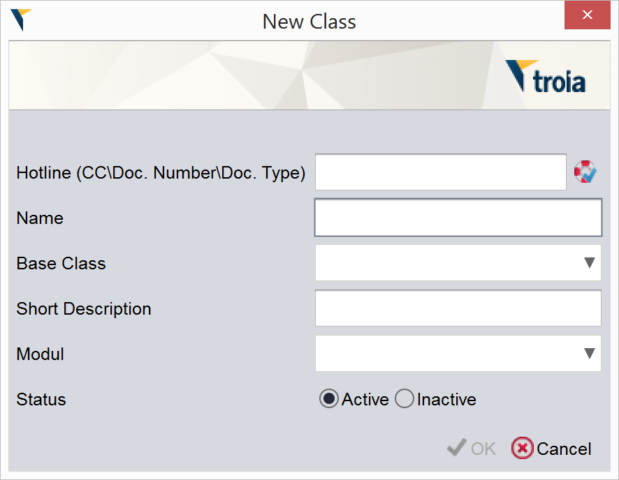

=======
Classes
=======

Introduction
------------

what is a class.

classes and scope.

Creating/Editing Classes
========================

Classes are defined and edit classes in TROIA IDE and "DEVT00 - Class-Browser" transaction. DEVT00 is an older option to manage TROIA classes but has some extra features such as creating SQL scripts for classes etc. We will focus on TROIA IDE to manage classes.

To create a new class you must click **TROIA IDE->New->Class** on menu and fill the new class form.

   
As it is obvious that, your class must have a unique name. It is not a compulsory define a base class for your new class, so you can leave base class field if your new class has not a base. "Short description" is a simple documentation text about your class. "Module" and "Status" are just for documentation issues and have no critical effect on class usage. After you click "OK" button on new class form, IDE creates a new class which contains two emtpty basic methods and opens your new class on object explorer.

To edit your existing classes you must click **TROIA IDE->Open Resource** on menu and find and open your classes. It is obvious that both for defining and editing classes requires an hotline which is a change request.

How Classes Stored and Laoded?
==============================

There are two types of information that defines a class.First one is class's own data which stored on SYSCLSHEAD table, such as its name,base class, shorttext etc. Second information that defines a class is its methods which stored on SYSCLSFUNC database table. When programmers define classes on IDE or related transaction, SYSCLSHEAD and SYSCLSFUNC tables store all information about new class.

When you convert a class, TROIA interpreter reads these two tables, compiles the code and saves binary class files with .cls extension to user's class path. Only these files are read when class instances created, in other words when a class defined system does not access database tables that stores class information and codes.

Basic Class Methods
--------------------

Classes has two predefined methods named _VARIABLES, _CONSTRUCTOR, this methods are called when an variable definition command defines a new class instance. They are also called "class initializer" methods and mostly like constructors on other object oriented programming languages.

As a programming convention _VARIABLES method is used for defining members and other required variables and _CONSTRUCTOR method is used to build internal structures of class instance. But there is not a technical constraint to use them different purposes. Also it is possible to call function initializers manually but it is not a recommended.

The only two main difference between regular methods and class initializers:

- This methods are called automatically on class instance definiton.
- OBJECT Command's behaviour is different compared to its behaviour on regular class methods. 

For details about OBJECT command and scope issue, please read the related sections of this book.

Defining Class Instances
------------------------
Defining a class instance is as simple as defining an integer variable. The only difference is using your new type instead of "INTEGER". Here is an instance definition of "MATHTEST" class and it is same for all data definition commands such as GLOBAL, OBJECT, LOCAL etc.

::

	OBJECT:
		MATHTEST MATHREC;
	
When you defining a class instance you must consider all variable defintion points which are discussed previous sections. Additionally, when a variable definition command executed to define a class instance, class initilalizer methods are fired. But this methods are fired only once, in other words even if same instance are defined more than once class initilizers are fired only once. This rule is same both for same or different command instances. To understand the behavior correctly please see the trace of code below:

::

	OBJECT:
		INTEGER NINDEX;

	NINDEX = 0;

	WHILE NINDEX < 2
	BEGIN
		OBJECT:
			RDTA AREC;
			
		OBJECT:
			RDTA AREC;
			
		NINDEX = NINDEX + 1;
	ENDWHILE;

Calling Class Methods
---------------------

Classes also have methods that can be called from outside of the class over an class instance. There is a not a special syntax for calling a TROIA Class method. Most important part while calling a class method is specifying class instance name, because each instance can have an internal state. Here is a simple example of calling a class method:

::

	OBJECT:
		MATHTEST CLASSINSTANCE,
		INTEGER RESULT;
		
	RESULT = CLASSINSTANCE.SUM(5, 6);
	
It is also possible to define class methods as recursive and call other class methods. To call call a class method inside class THIS keyword is used, because developer of class is not able to possible instances of class. Here is a simple example:

::

	/* this is a class method code, which returns a text */
	PARAMETERS:
		INTEGER PA,
		INTEGER PB;
	
	LOCAL:
		INTEGER MAXNUM;
	
	/* class have another method named MAX */
	MAXNUM = THIS.MAX(PA, PB);
	
	RETURN 'Maximum number is ' + MAXNUM;
	

Class Inheritance
-----------------

Even if there are some differences compared to regular object oriented programming languages, its possible to inherit TROIA classes and override methods of base class (also its possible for dialogs). Inheritance and cross will be discussed detailly in next sections.
	

Sample 1: Math Operations
-------------------------