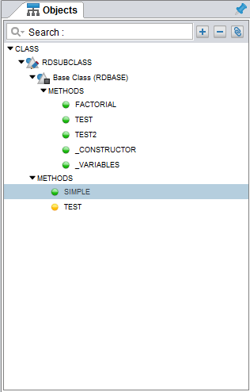
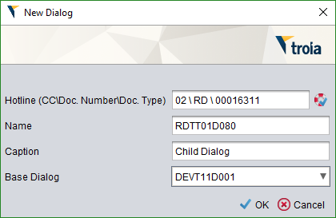
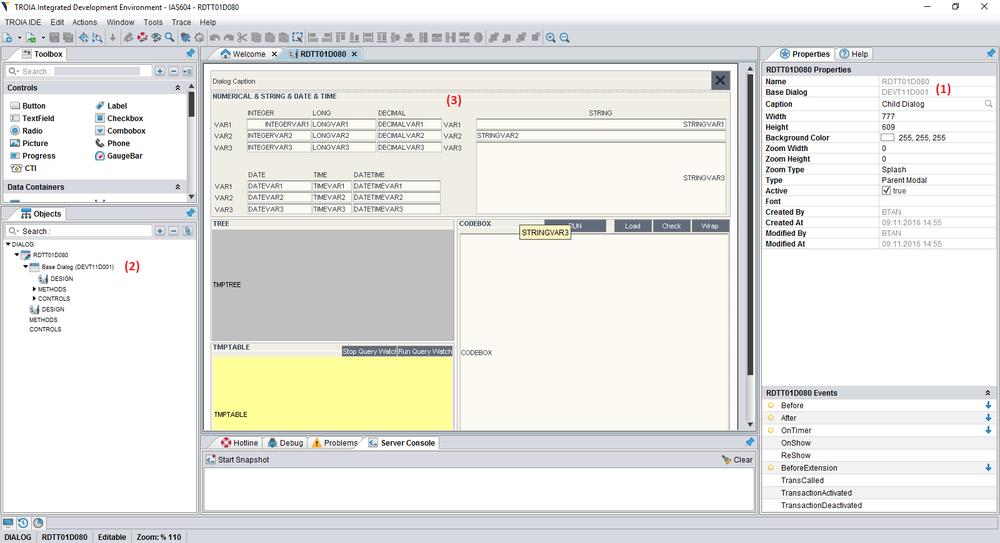
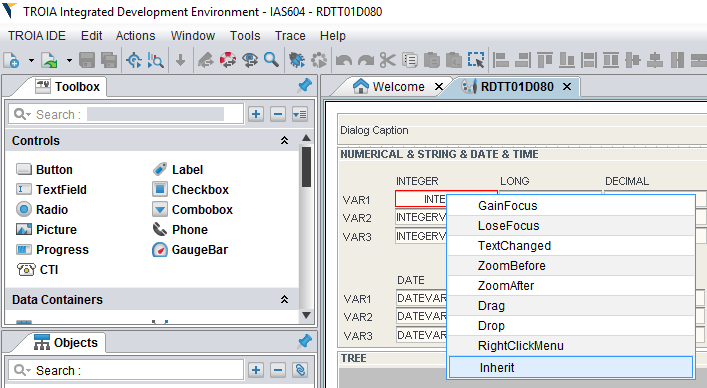

===================
Inheritance & Cross
===================

*Inheritance is one of the key concepts of object oriented programming. This sections aims to introduce inheritance and relelated concepts.*

What is "Inheritance"?
--------------------

Simply, inheritance is an object oriented programming mechanism that allows programmers to reuse class codes. In this method, programmers creates parent, child relationship between two class. A child class gets its features/behavior from its parent through a heritage and modifies parent's behaviors/features or adds new features/behaviours.

Inheritance on TROIA
--------------------

TROIA is also an object oriented programming language and supports inheritance for all TROIA item types (class, dialog, report, component).

As it is same in other programming languages, only inheriting an item does not mean changing its structure or behaviour, it only means creating heritage from base class. In practical if you only inherit an item, you can use base item with child's name. To change behaviour/structure, you must override one at least one method of base item or add a new method to child item. If you add a method which has same name with one of the base methods this means you **"override"** this method and change its behaviour. In TROIA jargon, overriding is called *inheriting a method* (In this book we will use "override method" term instead of "inherit method").

When it comes to technical background, for a good understanding of inheritance with all aspects, you need to know that compiler has the most important role in inheritance process, because all inheriting operations are performed on compile time. While conpiling a child class, compiler resolves parent/child information at first and after the compilation it creates child item's binary file. This binary file contains child item's own controls/methods, additionally it has a kind of link with base's binary data.

Inheriting Classes
======================
In class inheritance it is possible to add new methods to base class or override (called as inherit method in TROIA) methods of base class. To override a class you must indicate base class name in new class form on IDE (see classes section). When you inherit a class, method's of base class are shown on object explorer in base class tree element. Image below shows the view of an inherited class on Object Expolorer and menu item to override one of base methods.

When you override a base class method, system creates a same named method on child class and this method is executed instead of base method and this allows changing base method's behavior. Using same method, overriding _VARIABLES and _CONSTRUCTOR methods is also possible. With overriding this methods, it is possible to add member variables and this means changing the structure of base class on its child (remember the key roles of this methods.)
   
   
Inheriting Dialogs/Components
=============================

Inheriting dialog and component is also supported. To inherit a dialog, component you must set its base item in new item form (please see new dialog, component form on related sections). Overriding dialog methods is similar with overriding base class methods which is mentioned previous sections. It is also possible to override controls and control events on dialogs/components. Additionally, adding new controls and control events to child dialog/component is possible. Here is an image below that shows creating a new dialog that inherits DEVT11D001 as base dialog (it is also same for component inheritance).

   
After creating an inherited dialog, IDE shows base dialog name in property explorer(1), base dialog controls/methods on object explorer(2) and base dialog controls on dialog design panel (3). Please see the image below:

In dialog design panel it is not possible to change any control's positon or other properties, because this controls are base dialog's controls. To change a control feature you must firsly override control using "inherit" button which is located on control's right click menu. Overriding a dialog control creates a new control on child dialog and this new control overwrites same named control on parent dialog.

In IDE Object Explorer, there are some small icons (colorful dots) for each method to ease identifying. Here are the meanings of this icons:

Using SUPER() Method
--------------------
#using super method

Using SUPER Object
------------------
#using super object

What is "Cross"?
---------------

Simply, a cross is a definition that forces class/dialog loaders to use another class/dialog **instead of** defined item. For example if you define a cross from class A to class B, system loads class B instead of A anywhere class A is defined. Cross is a database record and it is read and applied on runtime, in other words it is not a part of compiling process. With crosses; there is no need to chage/modify standart application, so customer customizations need less efford and time.

Crosses are mostly used with an inherited class that changes structure/behavior of a base class or adds new functionalities to a base class. Assume that we have CAT class which have a MOVE method. This method increases the x position five by five. Here is the pseudocode of the structure and method of CAT class.

::
	
	class CAT:
		MEMBER:
			INTEGER X;
		
		function MOVE
			X = X + 5;
			RETURN;
	
	/* this code is not compilable, 
	   it is just for assumption */
			
and in somewhere of the standart application, an instance of CAT class is defined and its move method is called like below:
::

	OBJECT:
		CAT RECCAT;
	
	RECCAT.MOVE();
	
And assume again CATs on your company are lazy and move one by one. To solve this case you must find all CAT definitions and change them to your child LAZYCAT class or do something like a factory pattern to decide which cat type will be created. With cross concept you don't need to find and change all definitions. If you define a cross from CAT to your LAZYCAT class, system laods LAZYCAT instead of CAT class in all applications. Although cross is mostly used from a base item to a child item, it is possible to define a cross between independent classes (but please think on possible problems about crossing independent items).

It is possible to define crosses for dialogs, classes, reports and components. Cross definitions for classes usually called "class cross" and others are called "dialog cross".

Cross Levels & Loading Order
----------------------------

It is possible to define crosses in two level: "**system cross**" and "**user cross**". A system cross is system wide and if you define a system cross, this cross is valid for all users that connects to same database. User crosses are defined for a user or a profile, so this kind of crosses are valid for a user or users defined in a profile.

System; firstly reads system crosses. After system crosses; user crosses are read starting with deepest profile, and finally user's own crosses are read. Latest cross owerwrites previous cross definitions. In other words, priority order is user's own crosses, user's profile crosses, system crosses. Also it is possible to define crosses as chain here is a chain cross sample:

::

	A -> B
	B -> C
	C -> D
	
Cross information is loaded while user logging in, so crosses that defined/deleted while user online are ignored until user login again.

To remove a cross you can define a cross from item's itself (A -> A). But defining crosses as an infinite loop in more than one step is considered as TROIA level error and this may cause stackowerflow error or infinite loop on login. Here is an invalid cross definition:

::
	
	A -> B
	B -> C
	C -> A

How to Define Crosses
---------------------

For classes, system crosses are defined in "DEVT08 - Class Dynamic Link" transaction. To define a system cross for a class required data is only names of crossing and crossed class. System cross cross definitions for classes are stored in SYSCLSREF system table. To define cross for dialogs, reports and components "DEVT09 - Dialog Dynamic Link" transaction is used and this transaction uses SYSDLGREF system table to store cross definitions.

For users and user profiles; crosses are defined in "Class Reference" and "Dialog Reference" tabs of "SYS03 - User Login Info" transaction. User cross definitions are stored in IASUSERCLSREF and IASUSERDLGREF tables. As it is obvious; all user crosses are related with user definition and when user is deleted, all cross definitions are deleted.

Example 1: Understanding Cross Order
------------------------------------

Assume a U1 user whose user profile is P1 and P1's base profile is P0. Cross definitions are like below:

::

	SYSTEM : A -> B
	SYSTEM : C -> D
	SYSTEM : E -> F
	SYSTEM : G -> H
	P0 : K -> L
	P0 : A -> N
	P1 : A -> X
	P1 : C -> C
	U1 : A -> Y
	U1 : F -> Z
	
What is the final cross table for the user?
	
	
	
	

	