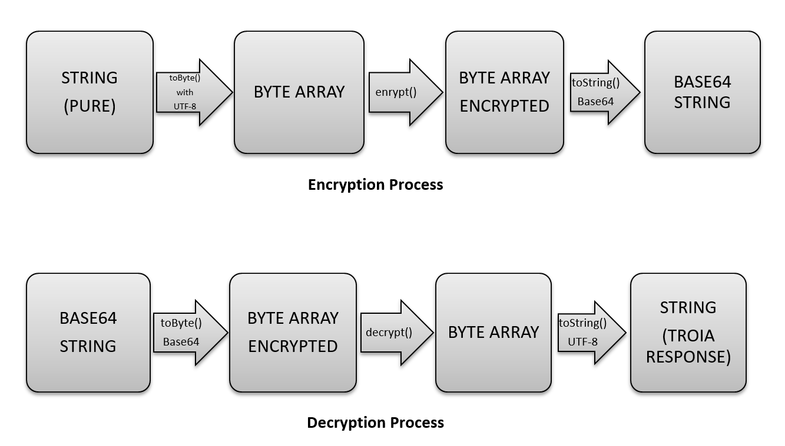
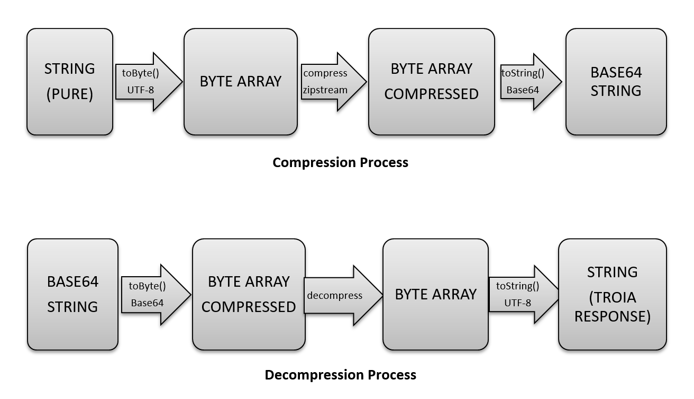

============
Web Services
============

*TROIA Platform supports defining web services/methods which allows 3rd party applications to access business applications/database over TROIA codes. This section aims to introduce TROIA Web Service infrastructure for 3rd party application developers.*

Introduction
------------

..introduction

WSDL Overview
=============

Installation
------------

..installation

..Testing Web Service Installation

Service Definition & Permissions
--------------------------------

..defining

..user rights

Log-in/Log-out over Web Service
-------------------------------

login() Method
==============

login () method creates a connector session on CANIAS Application Server if login credentials is correct.

Client, Language, DBServer, DBName, ApplicationServer, Username are default login parameters. Password parameter can be passed as MD5 hash or pure password string, authentication sub system detects password format automatically.

In addition to these parameters login method gets a boolean Encrypted flag. Encrypted flag enables encrypted connection between client application and CANIAS Web Service.

Client application must be indicate whether compression will be enabled or not at callService() requests during the session. If client application sends true as compression parameter, server activates automatic compression subsystem.

LCheck parameter is used internally; client application must pass an empty string as LCheck parameter.

VKey parameter is used internally; client application must pass an empty string as VKey parameter.

login() method returns LoginResponse complex type which has members below:

 - **Success (Boolean) :** If login is successful, this field is set to true, otherwise false.
 - **SessionId (String) :** This member returns user’s session id, otherwise. If login fails it is an empty string.
 - **SecurityKey (String) :** Application Server returns a random security key for each successful login. Client application must pass this security key parameter while calling callService () method, to indicate it’s an authenticated application.
 - **ContactNum (String) :** This member returns users ContactNum which is stored in CONTACTNUM column of IASUSERS table.
 - **ErrorMessage (String) :** If login fails, this field returns login error message in given language; else this field is an empty string.
 - **EncryptionKey (String):** If client application connects an encrypted connection, application server returns an EncryptionKey which will be used at service interactions. Client application must convert EncryptionKey to byte array using UTF8 encoding before using this key as encryption key.
 
 

logout() Method
===============

logout() gets SessionId parameter as string and removes connector session which has given session id. Method returns true if log out operation is successful. 

Listing Available Services
--------------------------

**listServices()** method of TROIA web service gets SessionId as string parameter and returns all available services as string array. **Web Services which user has not permission to call are not included in returning array.**
 
If returning array does not include name of web service that you want to call, you must check whether your method is registered as web service and user who is connected as web service  client has permission to run registered service.

Calling Services
----------------

callService() method
====================

callService() method is used for running a TROIA Class Method which is registered as a TROIA Web Service. Method has six input parameter. Detailed information about these input parameters are below:

- **SessionId (String) :** Session Id must be stored by web service client and sent at all service calls. Session Id data is used for accessing correct connector session in application server.
- **SecurityKey (String) :** SecurityKey which is supplied by a successful login response must be passed to callService() method. ApplicationServer compares session’s security key and request’s security key to state whether caller application is an authenticated application or not.
- **ServiceId (String) :** ServiceId, key value while accessing all service information like service class, method name and web service rights. 
	If given ServiceId is not registered, service call fails and return value shows service call’s failure message. Understanding whether a service call failed is possible using callService() method’s complex return value. For more information please review structure of CaniasResponse complex type.
- **Parameters (String) :** Client applications can pass parameter to CANIAS Web Services as XML formatted String.
	callService() method gets parameters to pass TROIA method which is defined as web service. Default XML Format is like below:

	::

		<PARAMETERS>
			<PARAM>firstparam</PARAM>
			<PARAM>secondparam</PARAM>
			…
		</PARAMETERS>

	<PARAM> element can define parameter encoding as plain or base64 like <PARAM encoding=”base64”> to indicate value of parameter is encoded as base64 string. If parameter encoded as base64 string, system converts base64 string to UTF-8 string before using parameter value. If param element contains special chars CDATA block can be used to force parsers ignore. Default value of encoding is plain. Example:

	::

		<PARAMETERS>
			<PARAM encoding="base64">cGFyYW0x</PARAM>
			<PARAM>secondparam</PARAM>
			<PARAM><![CDATA[third param value contains > char]]> </PARAM>
			…
		</PARAMETERS>

	Client applications are able to pass table and vectors as parameter to web service. In this case type of parameter must be indicated using type attribute in <PARAM> element. If parameter is a primitive type such as string, integer, long or decimal there is no need to add type attribute. If table or vector parameter is passed to a web service system automatically parses xml and creates a table or vector symbol. (Vectors are able to contain primitive variables such as string, integer, long, date etc.) Example:

	::

		<PARAMETERS>
			<PARAM>firstparam</PARAM>
			<PARAM>1</PARAM>
			<PARAM>1.5</PARAM>
			<PARAM TYPE="TABLE">
				<TABLE_VARIABLE_NAME>
					<ROW>
						<COL1>row1 col1 value</COL1>
						<COL2>row1 col1 value</COL2>
					</ROW> 
					<ROW>
						<COL1>row2 col1 value</COL1>
						<COL2>row2 col2 value</COL2>
					</ROW>
				</TABLE_VARIABLE_NAME>
			</PARAM>
			<PARAM TYPE="VECTOR">
				<VECTOR_VARIABLE_NAME>
					<ITEM>
						<NAME>TROIASYMBOL1</NAME>
						<TYPE>STRING</TYPE>
						<VALUE>value1</VALUE>
					</ITEM>
					<ITEM>
						<NAME>TROIASYMBOL2</NAME>
						<TYPE>LONG</TYPE>
						<VALUE>3</VALUE>
					</ITEM> 
				</VECTOR_VARIABLE_NAME>
			</PARAM>
			<PARAM>another parameter</PARAM>
			…
		</PARAMETERS>

	If communication is an encrypted connection, parameters must be encrypted by client application. For more information about web service please review “Encryption” section. 

	Parameters value can be compressed due to requirements of client application. For more information about compression issue please review “Compression” section. If parameters string compressed in an encrypted connection, client application must perform compression after encryption.

- **Compressed (Boolean) :** Indicates whether parameters are compressed or not. If parameters are compressed true value must be passed, otherwise false value must be passed.
- **Permanent (Boolean) :** For each service call, application server opens a transaction automatically and executes all TROIA codes in this transaction. After procedure finished transaction is closed. If client application sends true as permanency option, application server does not close transaction, and next service codes are executed at same scope.
- **ExtraVariables (String) :** CANIAS Web Service is able to return value of TROIA variables in addition to default return value. So if client application sends variable names as ExtraVariables parameter, application server returns value of any variable from any scope. If client application needs value of more than one TROIA variable, variable names must be passed as comma separated string.
	Returning complex types like table and class instance is not supported.
	
- **RequestId (Integer) :** Request Id is simple id number of each service call. ApplicationServer returns response of a request with same id number, so client applications can find request and response pairs. Due to client application architecture, this number can be useless. If client application does not use a request and response id information send 0 (zero) or any other number to callService() method.

Return Value of callService() Method
====================================

callService() method returns CaniasResponse which is a complex data type containing response, extra variables and some extra data about web service execution. All members of CaniasResponse complex type are listed below:

- **Response (StringResponse) :** This field stores the returning value of TROIA Class method which is registered as WebService.
	StringResponse complex type has two members. Value is requested string value. Compressed is a flag which shows whether value is compressed or not. If Compressed flag is set to false, Value filed stores return XML directly. Otherwise to get pure text, Value field must be decompressed. For more information about compression issue please review “Compression” section.
	
	If communication is an encrypted connection, StringResponse must be dencrypted by client application. For more information about encryption please review “Encryption” section.

- **SYSStatus (Integer) :** After execution of TROIA Class method which is registered as web service, ApplicationServer returns latest value of SYSStatus symbol, so client application can use this value due to its requirements.
	If web service cannot access application server or there is not a web service with given name SYSStatus value is set to 1 and StringResponse is set to empty string.
			
- **SYSStatusError (String) :** This field stores value SYSStatusError system symbol.

- **RequestId (Integer) :** Web Service directly returns same value of callService() method’s RequestId parameter.

- **ExtraVariables (StringResponse) :** ExtraVariables member stores extra variables that are requested by client application. 
	StringResponse complex type has two members. Value is requested string value. Compressed is a flag which shows whether value is compressed or not. If Compressed flag is set to false, Value filed stores return XML directly. Otherwise to get pure text, Value field must be decompressed. For more information about compression issue please review “Compression” section.
	
	Resulting value contains symbol name, symbol type and value as XML format. Format of extra variable xml is below:
	
	::
	
		<EXTRAVARIABLES>
			<VARIABLE>
				<NAME> … </NAME>
				<TYPE>…</TYPE>
				<VALUE>…</VALUE>
			</VARIABLE>
			<VARIABLE>
				<NAME> … </NAME>
				<TYPE>…</TYPE>
				<VALUE>…</VALUE>
			</VARIABLE>
			…
		</EXTRAVARIABLES>

- **Messages (StringResponse) :** All TROIA messages created while TROIA code is running are stored by application server and returned at Messages field of CaniasResponse. 
	
	StringResponse complex type has two members. Value is requested string value. Compressed is a flag which shows whether value is compressed or not. If Compressed flag is set to false, Value filed stores return XML directly. Otherwise to get pure text, Value field must be decompressed. For more information about compression issue please review “Compression” section. 
	
	Messages string contains message text, module, message type and message number as XML format. Format of Messages extra variable xml is below:
	
	::
	
		<TROIAMESSAGES>
			<MESSAGE>
				<TEXT>…</TEXT>
				<MODULE> … </MODULE>
				<TYPE>…</TYPE>
				<NUMBER>…</NUMBER>
			</MESSAGE>
			<MESSAGE>
				<TEXT>…</TEXT>
				<MODULE> … </MODULE>
				<TYPE>…</TYPE>
				<NUMBER>…</NUMBER>
			</MESSAGE>
		</TROIAMESSAGES>

- **Compress (Boolean) :** If length of return value of TROIA class method’s is greater than 4000 characters. Application server compresses its value and sets this fields value is true. Otherwise it is set to false. 
	
	If data sent from web service is compressed, client application must decompress StringResponse field’s value. For more information about compression issue please review “Compression” section.

Encryption
----------

As its default behavior, system does not use encrypted communication. If encrypted communication is needed due to applications requirements, client applications must send true value as encryption information on login request.

Web Service encryption infrastructure uses AES as encryption standard (if required CipherMode:CBC, PaddingMode:PKCS7, KeySize:128 and BlockSize:128).  Required public key is supplied by application server and sent to client application on LoginResponse.EncryptionKey field. This value must be converted to byte array using UTF-8 encoding to get final encryption key for client side encryption and decryption processes. Encryption process converts string response to byte array using UTF-8 encoding and encrypts returning byte array. After encryption process resulting byte array is converted to Base64 String to enabling data transfer over web service. As a result of this process in order to get pure string response of web service call, client applications must convert Base64 String to byte array, decrypt this byte array and convert this byte array to string using UTF-8 encoding.

Additionally, for encrypted connections, client applications must send Parameters string as an encrypted string. The way of encryption must be same as server side encryption process and resulting value must be Base64 String. 

Compression
-----------

If compression enabled and length of service’s string response is greater than minimum compress size(4000 characters), application server converts string data to byte array with UTF-8 encoding, compress byte array and creates Base64 String. If server makes compression over pure response string, Compress field of CaniasResponse is set to true. Thus, if Compress flag is set to true, client application must convert Base64 String to byte array, decompress and convert decompressed byte array to string with UTF-8 encoding. Application Server’s web service infrastructure uses Zip Stream (DEFAULT_STRATEGY) while compressing byte arrays.

System does not apply compression to encrypted data.

