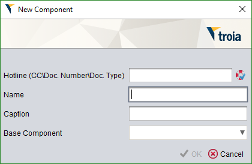
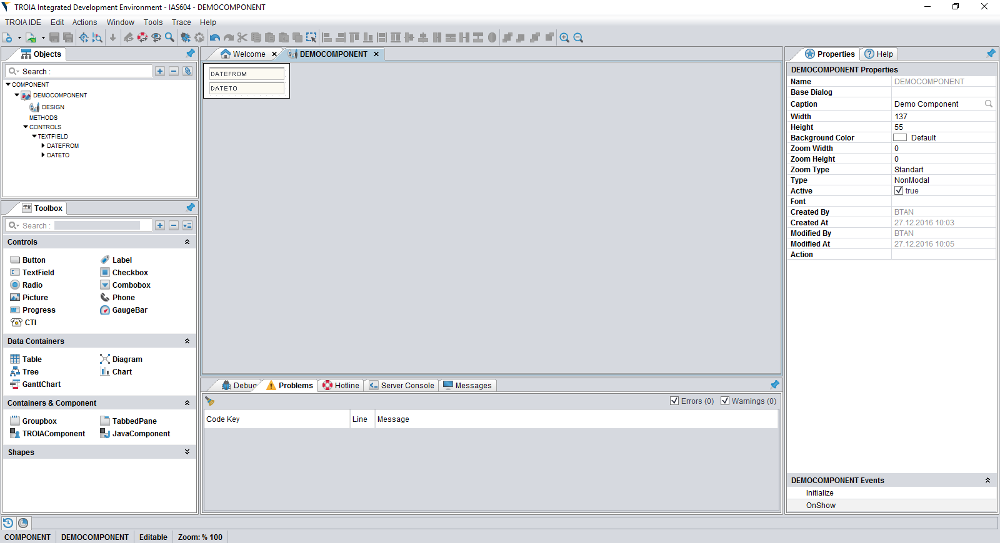
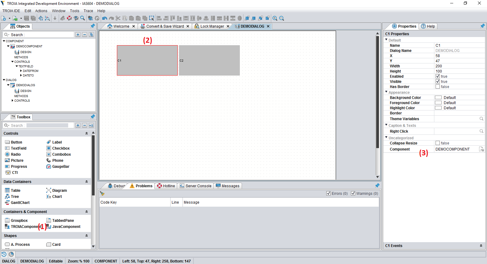
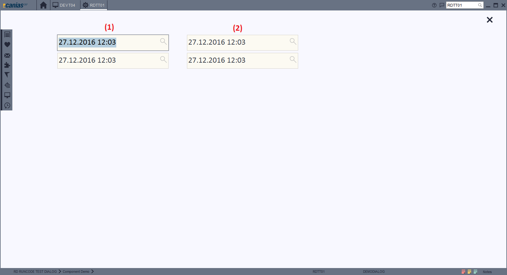
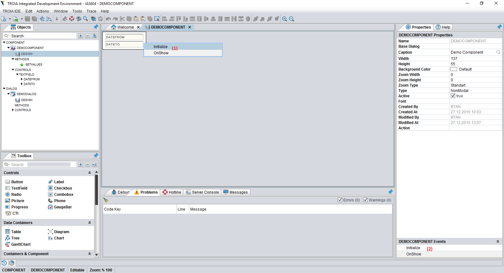
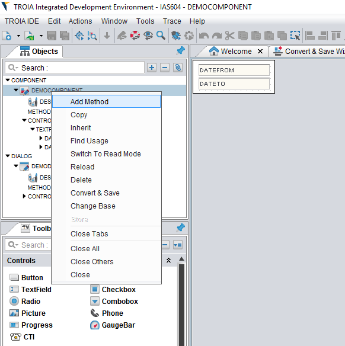
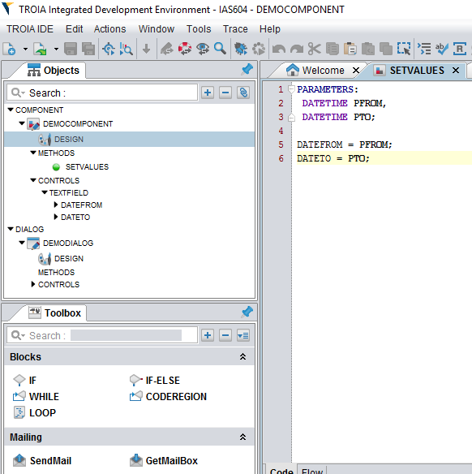

=======================
Custom TROIA Components
=======================

*Its possible to define custom business layer components and use instances of these components on different dialogs or other components. This sections aims to show how "custom components" are defined and used.*

While developing dialog user interfaces, programmers use ui items such as buttons, text fields, labels (ui controls). But in some cases, programmers may need to reuse a set of controls on different dialogs to avoid copying and pasting existing codes on different dialogs. A custom TROIA component is a reusable custom ui control which contains one or more simple controls to perform a specific action. Custom components are a type of TROIA development items such as dialogs or classes. Custom TROIA component is called as "component", shorty.

For instance, for a fligh reservation application you may need two date chooser one is for departure date and second one is returning departure date and you have to make a set of validity checks whether inserted dates are valid or correct order etc. If you write whole required code on a dialog, you have to controls troia code when you need a similar control set for an hotel reservation application. Using component infrastructure you define your date chooser as a component and use it on different dialogs.

How Components Stored?
======================

As it is obvious, components have controls, control events and methods. Therefore a component is similar to dialog from the aspect of items that they have. Similar to dialogs component data is stored on development tables which are already used for storing dialogs. This tables are SYSDIALOGS, SYSDLGTEXTS, SYSDLGCODES, SYSDLGFUNCTEX, SYSCONTROLS, SYSCTLTEXTS. For more  information about the roles of this table, please see "Dailog Basics/How Dialogs are Stored?" section.

Defining Components
-------------------

Similar to other troia development items, components are defined using TROIA IDE, too. To create a new component, you must click **TROIA IDE-> New -> New Component** on menu and fill the new component form which is very similar to new dialog form.

   
In this form you, must select a hotline (change request) and enter a valid component name. A valid component name is unique and at least four characters length similar to dialogs. 

Inheriting and defining cross references are also supported for components and works in same way with dialogs. Please see the related section to get more informatin about inheriting. 

After you click "OK" button, IDE creates a new component and opens design window. In this design window you can create your component due to your requirements. Here is my sample component that has two date fields on it.

Using Components
----------------

To use a component on a dialog, you must just drag a "TROIA Component" (1) from toolbox and drop it on dialog (2). And write the component name to "Component" feature of your dragged control (3). Each component instance must have a unique control name such as other controls.

After saving and calling the dialog, the final view is below. This dialog has two component instances named C1 (1) and C2 (2).

   
Nested Components
=================

It is also possible to use components inside other components. This process is totally same with using a component on dialog.

Component Events
----------------

Components have a predefined event named INITIALIZE which is called when a component instance is created. With this method TROIA programmers are able to set initial state of a component. To implement INITIALIZE method you must right click to component on design view (1) or double click the evet on events explorer which is under the properties explorer (2).

For example if you write the code below to initialize method. Components shows current date as DATEFROM and tomorrow as DATETO.

::

	DATEFROM = CURRENTTIMEMILLIS();
	DATETO = ADDDAYS(DATEFROM, 1);

   
Components & Scope
------------------

Developers are not able to know in which dialogs component will be used while developing a component. What if varaible names conflicts with existing variables on dialogs? or if a dialog changes one of component's variable? Actually this questions are not valid for components because components have their own scope, so even a variable defined in compoent has same name with a dialog component they are not same variables. Therefore conflictions are not possible. For example, SYS_STATUS in component scope is not same with SYS_STATUS in global scope, they are totally different variables.

Accessing Variables Which Defined in Component
==============================================
As a result of component's have a different scope, it is not possible to access (read or set) variables defined in component from dialog codes. To do this you must call component's public methods, if component have such methods. Defining getter/setter methods is the responsibility of programmer who developes component. Calling component methods will be discussed in next sections.

Calling Dialogs from Components
===============================

Also it is possible to call a dialog from component. Dialogs which is called from dialogs are a part of the component, so all variables defined on dialog (by code or control symbols) are located in component's scope.

Calling Component Methods
-------------------------

Components is able to have some public methods that can be called from outside the component. To define such a method, you must select "Add Method" from right click menu on IDE and fill method content.

   

   
Calling a component's method is not different from calling a class method. You must call the method for the component's instance name. Here is sample dialog code that calls SETVALUS() method of C1 which is an instance of DEMOCOMPONENT.

::

	C1.SETVALUES('01.01.2016 10:10:10', '01.02.2017 10:10:10');
	
This code runs on C1's context and changes only FROM and TO dates of C1 instance. Other instances of DEMOCOMPONENT are not affected from this call.

Component Actions
-----------------

FIRECOMPONENTEVENT Command
==========================

::

	FIRECOMPONENTEVENT {eventname};

	