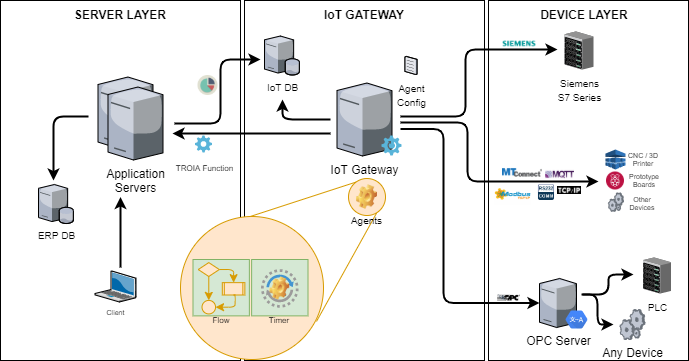

=============================
IOT Infrastructure
=============================

*TROIA platform contains an IOT infrastructure that allows you to collect data via various protocols, storing data and take some actions due to collected data. This section aims to introduce you IOT infrastructure in TROIA platform.*

Main Architecture and Components
--------------------------------

IOT Gateway
===========

IOT Connector
=============

Application Server
==================

License Server
==============

IOT Gateway
-------------

Configuration
=============

Agent
=====

IOT Connector
---------------

IOT Rules
=========

Local Scripts
=============

Supported Protocols
-------------------

