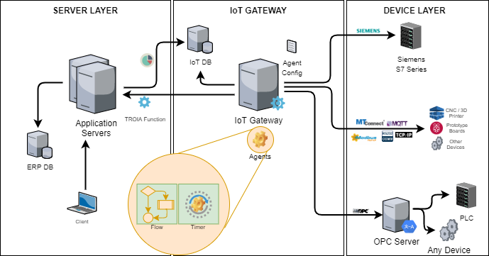

=============================
Integration Edpoints
=============================

*TROIA platform is a flexible business application development platform with its integration facilities. Endpoint configurations is one of these integration facilities. This section aims to introduce integration endpoints infrastructure and related commands.*

What is an "Integration Endpoint"?
-----------------------------------

Endpoint is, in the simplest terms, an access point through which a system is exposed to the outside world. When you want to interact with an application (API, service, system), the address + target function you send a request to is called an endpoint.

From the perspective of the TROIA Platform, an endpoint is a definition you need to create when you want to access something outside of the TROIA Server.

In TROIA Platform builds 26.05.XX-XX and earlier, accessing external systems was done using specific TROIA commands without the concept and definition of endpoints. However, after this build, many of these accesses are done through endpoint definitions.

There are several advantages to accessing external systems through the concept and definitions of endpoints. The first is the ability to manage very similar configuration structures with a single application. Another advantage of endpoint definitions is the ability to define access restrictions on a profile and user basis by defining user permissions for endpoints.Finally, the ability to use the same commands and functions when connecting to different endpoint types makes the learning process easier.

How to Configure Endpoints?
===========================

Where configurations stored?
============================

Which Endpoint Types are Supported?
-----------------------------------

Authorization for Endpoint Configurations
=========================================

Endpoint Connections
---------------------------

Creating New Connections
===========================

Closing Connections
===========================

Performing Operations on an Endpoint Connnection
================================================

