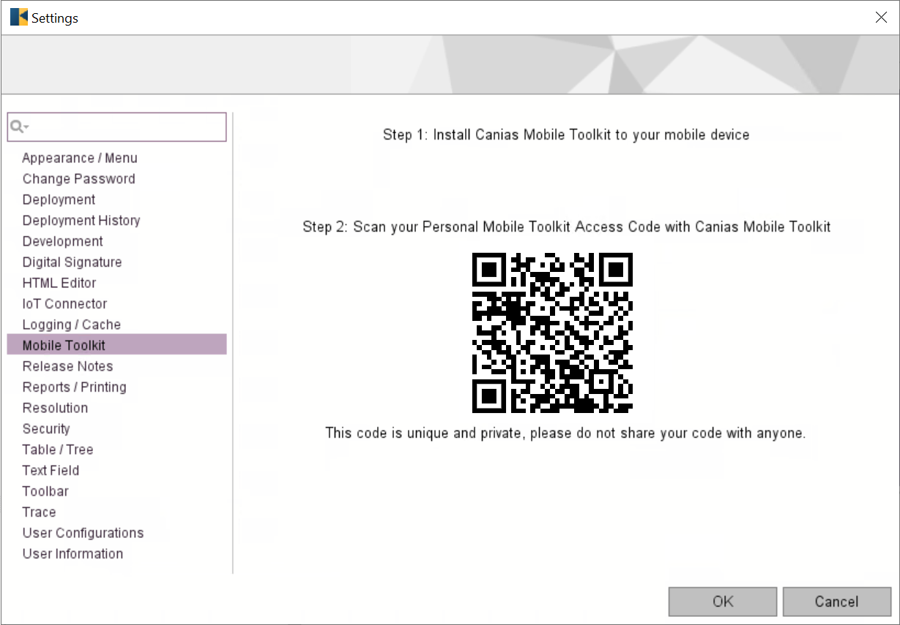

=========================
Mobile Toolkit
=========================

*Troia Platform includes a mobile application for IOS and Android called "Mobile Toolkit" that access the system via rest web services and performs some basic functions in the business application layer. This section aims to introduce Mobile Toolkit and explaion how to activate it.*

Introduction
------------

Main Architecture
==================

...

Does Your Build Supports Mobile Toolkit
=======================================

...

How to Enable Mobile Toolkit Access
-----------------------------------

Enabling Mobile Toolkit access, there are two levels of operations. First one is Rest URL configuration which opens a channel between the application and your servers. Second level is about user permissions.

Rest URL Configuration
======================

As mentioned previous sections, system uses restful web services while transferring data between Mobile Toolkit and application servers.So **you must definitely have a properly running restful web services** in your installation and **these services neet to be accessible from any network environment that your clients uses Mobile Toolkit**. 

To have properly running restful web services deployment is not the subject of this section but if you have an web client deployment you probably have an restfull depoloyment. Because restful web service and web client are a bundle. If you visit a url  **{your_web_client_url}/rest/stateless/v1/** with your browser and see some message like below probably you have restful service deployment.

::

	{
	  "response": "",
	  "error": "service name is missing"
	}

User Permissions
================

**To view mobile toolkit access url, users must have "MOBILETOOLKIT" transaction right.** This right can be defined for users and profiles on "SYST03 - System Users" transaction. So it is possible to manage Mobile Toolkit users considering users, profiles and databases that can be accessed from an application server.

How to Install Mobile Toolkit to Your Mobile Device
---------------------------------------------------

You can download and install the application on Google Play for your Android devices, or on Apple Store for your IOS devices. To do this you can search "Canias Mobile Tooolkit" on these platforms. Also, you can access the application by using the links or scanning the barcodes on Settings-> Mobile Toolkit page on main web and desktop client.

Downloading the app to your mobile device does not mean that you can access your system immediately. To start using the application, your system administrator must allow you to connect via the Mobile Toolkit. 

**If you can access the Settings->Mobile Toolkit tab on the client and see a personal access link, that means you have access permission via the mobile toolkit.** Otherwise please contact with your system administrator.

   
This personal code contains required info to contact with your servers, so **users have to scan this code with the Mobile Toolkit application for once**. Mobile toolkit has some simple steps to guide the user, so it is enough to follow the instructions on the application to use the application.

Basic Functions and Customization
---------------------------------

Mobile Toolkit is designed to make the most needed functions of the business layer modules accessible on mobile devices. **These functions are compatible with the standard version of Canias and customer-specific customizations are not included.** These functions will change over time depending on the version of the application used. You can review the list below for the basic functions of Mobile Toolkit:

- User Push Notifications
- KPI List
- BPM Processes

**It is not possible to make customizations on Mobile Toolkit for any level such as UI, basic functionality etc.**

Possible Problems & Their Solutions
-----------------------------------

	