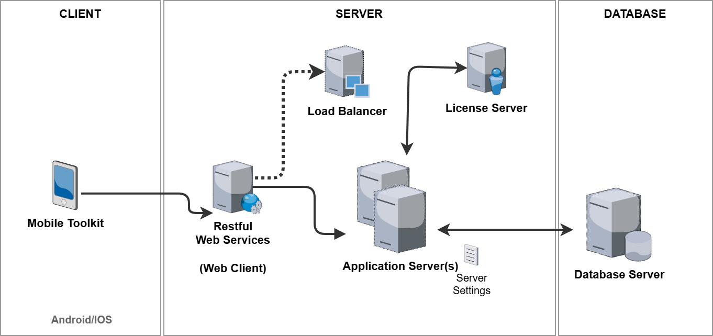

=========================
Mobile Toolkit
=========================

*Troia Platform includes a mobile application for IOS and Android called "Mobile Toolkit" that access the system via rest web services and performs some basic functions in the business application layer. This section aims to introduce Mobile Toolkit and explaion how to activate it.*

What is Mobile Toolkit?
-----------------------

Mobile toolkit is an React Native based, mobile application that targets to provide some personal functions of Canias ERP such as BPM processes, KPI's, calendar management, leave management etc.

It communicates with TROIA Application Servers as if it were a third-party application via a fixed interface such as a restful web service. The restful service calls a TROIA class called SYSMOBILETOOLKIT prepared for Mobile Toolkit and transfers various processes in the business layer to the mobile device. Mobile Toolkit does not communicate other business layer classes directly.

   

Communication Channel: Restful Service
======================================

As mentioned before, system uses restful web services while transferring data between Mobile Toolkit and application servers.So **you must definitely have a properly running restful web services** in your installation and **these services neet to be accessible from any network environment that your clients uses Mobile Toolkit**. 

To have properly running restful web services deployment is not the subject of this section but if you have an web client deployment you probably have an restfull depoloyment. Because restful web service and web client are a bundle. If you visit a url  **{your_webclient_url}/rest/stateless/v1/** with your browser and see some message like below probably you have restful service deployment.

::

	{
	  "response": "",
	  "error": "service name is missing"
	}
	
For more information about TROIA restful web services please read the related section or contact with your system consultant.

Mobile Toolkit Support
======================

To run Mobile Toolkit, you must have a TROIA Platform build that supports Mobile Toolkit infrastructure. **Builds after 25.04.20-01 support mobile toolkit and required restful services.** If your build is older than 25.04.20-01, firstly you must upgrade to proper build.

Mobile Toolkit has also business layer functions so it has some requirements on business layer. If your Canias version is older than 9.03 it is not possible to run mobile toolkit, because **9.03 is the first Canias version that supports Mobile Toolkit.** Additionally, to run business layer functions properly your system must have related business layer patches for Canias Modules, because the data requested by mobile toolkit is provided by classes defined in Canias. As mentioned, the most important TROIA Layer class is SYSMOBILETOOLKIT, because is a kind of gateway between your mobile device and business layer applications.

How to Enable Mobile Toolkit
----------------------------

Enabling Mobile Toolkit access, there are two levels of operations. First one is Rest URL configuration which opens a channel between the application and your servers. Second level is about user permissions.

Configuring Mobile Toolkit URL
==============================

After enabling your restful web service configuration, you need to configure a mobile toolkit access URL on your server configuration file (this file is usually called "ServerSettings" file). To do this you must add **MobileToolkitRestURL** keyword **under [System] section of your server configuration file.** Here is the syntax:

::

	MobileToolkitRestURL = {your_webclient_url}/rest/stateless/v1/?profile={profile_name}
	
**URL must be accessible from any network environment that Mobile Toolkit is used on.** And given profile ( {profile_name} ) name must be defined in your client-profiles.cfg file in your web client. Please be sure that given profile contains Application Server or Load Balancer addresss correctly.

User Permissions
================

**To view mobile toolkit access url, users must have "MOBILETOOLKIT" transaction right.** This right can be defined for users and profiles on "SYST03 - System Users" transaction. So it is possible to manage Mobile Toolkit users considering users, profiles and databases that can be accessed from an application server.

How to Install Mobile Toolkit to Mobile Devices
-----------------------------------------------

You can download and install the application on Google Play for your Android devices, or on Apple Store for your IOS devices. To do this you can search "Canias Mobile Tooolkit" on these platforms. Also, you can access the application by using the links or scanning the barcodes on Settings-> Mobile Toolkit page on main web and desktop client.

Downloading the app to your mobile device does not mean that you can access your system immediately. To start using the application, your system administrator must allow you to connect via the Mobile Toolkit. 

**If you can access the Settings->Mobile Toolkit tab on desktop/web client and see your "Personal Mobile Toolkit Access Code" as QR, that means you have access permission via the mobile toolkit.** Otherwise please contact with your system administrator.

   
"Personal Mobile Toolkit Access Code" contains required info to contact with your servers, so **users have to scan this code with the Mobile Toolkit application for once**. Mobile toolkit has some simple steps to guide the user, so it is enough to follow the instructions on the application to use the application.

   

Managing Connected Devices
--------------------------
Once you configure Canias Mobile Toolkit access via a mobile device, the system will link your mobile device to your Canias account so it can send you push notifications. You can view the mobile devices linked to your account in Settings->Mobile Toolkit (Connected Devices). From this screen, you can manage or delete devices connected to your account.
.. figure:: images/mobiletoolkit/connected-devices.png
   :width: 600 px
   :target: images/mobiletoolkit/connected-devices.png
   :align: center

Basic Functions and Customization
---------------------------------

Mobile Toolkit is designed to make the most needed functions of the business layer modules accessible on mobile devices. **These functions are compatible with the standard version of Canias and customer-specific customizations are not included.** These functions will change over time depending on the version of the application used. You can review the list below for the current functions of Mobile Toolkit:

- User Push Notifications
- KPI List
- BPM Processes
- Mail Management

**It is not possible to make customizations on Mobile Toolkit for any level such as UI, basic functionality etc.**