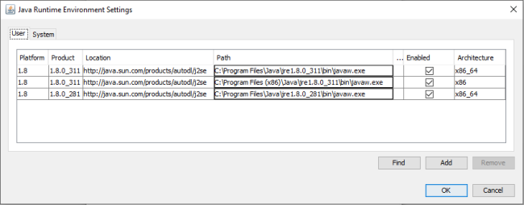

=========================================
Basic Java Concepts For TROIA Developers
=========================================

*TROIA Platform works on Java Virtual Machine, so to know about Java saves time in some special cases such as performance optimization, debugging and deployment. This section aims to introduce basic and useful java concepts for troia developers or system administrators.*

What is Java
------------

Java is a simple, high-level, object-oriented, general-purpose programming  language. It works on a virtual machine which is called JVM. So java applications work on anywhere which JVM works on, so it is a "write once, run anywhere" programming language.

Main Advantages
===============

Java offers some economic and technical advantages and all this advantages become a part of the solutions that are devloped with Java. Here are some of the pros of Java programming language.

**Object oriented :** enhances the flexibility and reusability of the code.

**Readible :** it is a high-level programming language, so it is human readible and reduces maintenance costs.

**Platform-independent :** java applications work on anywhere which JVM works on, so they are portable.

**Supports multithreading :** multithreading helps us to gain the maximum utilization of CPU and allows handling larger data and more complex problems in relatively short running time.

**Simple and secure :** Memory management is handled by garbage collector, there is no complex concepts like pointers, it is easy to learn.

Where java codes stored?
========================

Java codes are stored in files which has **.java** extension. These files can be edited via complex IDEs (eclipse,netbeans etc) or simple editors (notepad, vi). In a large application, there can be numerous .java files. 

How java programs run?
======================

Java is combination of compiled and interpreted languages. .java files are compiled by javac which is a component of JDK and .class files are generated. These .class files contains bytecodes which can be interpreted for the underlying platform that the application runs on. 

This interetation process is handled by JVM (Java Virtual Machine). This interpretation process isolates, .class file which is the result of compilation proces and the host machine. .class files are loaded by class loader and executed by Execution Engine. JVM has complex subcomponents such as class loader, execution engine, garbage collector, runtime memory etc., but these components and their running metodology is out of our scope.

JVM is a subcomponent of JRE.

JRE / JDK
----------------

JRE (Java Runtime Environment)
==============================

JRE is a software layer that runs on operating system and provides class libraries, virtual machines, and other tools that a particular java application needs to execute such as deployment solutions (Java Web Start), development tookit (java 2D, awt, swing),	integration libraries (JDBC,JNDI), 	language and utility libraries (logging, concurrency utils etc). JRE becomes operational at the moment when the application program is executed.

In windows operating system, installed JRE versions are listed Control Panel-> Java -> Java Tab (Viev Button)

JDK (Java Development Kit)
===============================

.. figure:: images/java/java-jdk.png
   :width: 385 px
   :target: images/java/java-jdk.png
   :align: center

Java SE/EE/ME
-------------

. . . 
Server JRE

JVM and JVM Arguments
---------------------

Java Releases
-------------

. . . 

Some Basic Java Terms
---------------------

ClassPath
=========

.java Extension 
===============

ByteCode and .class File Extensions
===================================

.jar and .war Extensions
=============================

JNLP / codebase
================

Java Console
============

Fonts in Java
==============

Environment Variables and JAVA_HOME
-----------------------------------

Understanding Java Exceptions
-----------------------------

Java Exception Types, Compile/RunTime/Errors

Exceptions/Error

NullPointerException

ArrayIndexBound

ParseException

NoSuchElement

ClassCastExcept

ClassNotFoundError

Logging
-----------------------------

Optimization Tools
------------------

Monitoring Tools
-----------------

	