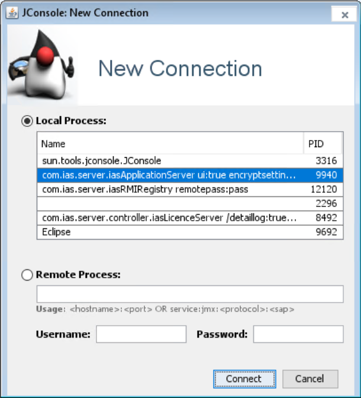
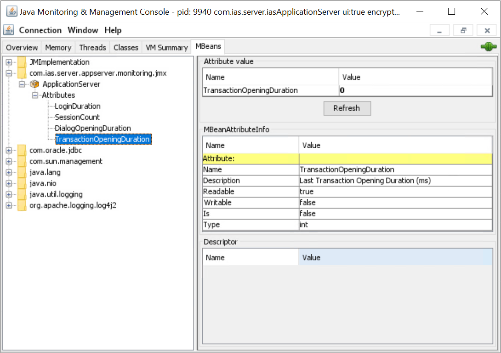
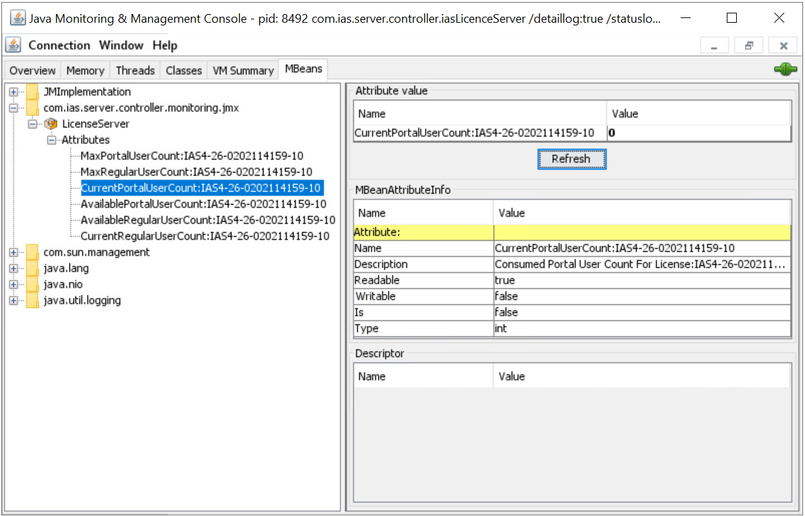

=========================================
Monitoring with JMX
=========================================

*JMX is a Java technology used to monitor and manage Java applications while they’re running. This section aims to explain how to read monitoring data using JMX from TROIA Platform Components.*

What is JMX?
============

JMX (Java Management Extensions) is a Java technology used to monitor and manage running Java applications. It is a standard mechanism that allows us to observe the internal state of a running Java application from the outside and manage it when necessary.

It allows monitoring JVM information such as RAM/heap usage, the number of threads, garbage collection, and CPU usage. It can also expose application-specific metrics via structures called MBeans.

JConsole, VisualVM, and Prometheus JMX Exporter are widely used tools for monitoring Java applications that support JMX.

TROIA Platform is also a Java-based system, so it is possible to monitor TROIA Platform components using JMX just like any other Java application. Some components, such as License Server and Application Server also provide special MBean data in addition to attributes provided by standard Java application. **These TROIA-specific MBeans are supported in build 26.08.11-01 and later builds.** If your TROIA Platform build is older than this build, you can monitor server-side components, but TROIA-specific MBeans will not be available.

How to Enable JMX?
==================

To enable JMX for a JVM you must provide required JMX parameters, you must at least provide jvm parameters below:

::

    -Dcom.sun.management.jmxremote
    -Dcom.sun.management.jmxremote.port=YourJMXPortNumber
    -Dcom.sun.management.jmxremote.authenticate=false
    -Dcom.sun.management.jmxremote.ssl=false

In a production environment you must use a more secure configuration, with SSL and authentication options, or port restriction methods. However for local environment this minimal configuration is sufficient for testing. **For production, please review JMX security options and port restriction methods about JMX.**

TROIA Platform checks two system properties to determine whether JMX enabled or not: **com.sun.management.jmxremote** and **com.sun.management.jmxremote.port**. If both parameters are provided for the JVM, the system enables MBeans and their TROIA specific attributes.

TROIA Specific MBeans
=============================

All TROIA Platform components support JMX, but the application server and license server also provide custom MBean attributes related to their internal operations.

Application Server
------------------

Application Server provides a MBean named **ApplicationServer** in **com.ias.server.appserver.monitoring.jmx** package and this MBean contains some attributes about application servers state. Here is the list of the attributes:

+-----------------------------+-----------------------------------------------------------------------+
| ServerSessionCount          | Session Count on Application Server                                   |
+-----------------------------+-----------------------------------------------------------------------+
| LoginDuration               | Last Login Operation Duration (ms)                                    |
+-----------------------------+-----------------------------------------------------------------------+
| TransactionOpeningDuration  | Last Transaction Opening Duration (ms)                                |
+-----------------------------+-----------------------------------------------------------------------+
| DialogOpeningDuration       | Last Opening Duration (ms)                                            |
+-----------------------------+-----------------------------------------------------------------------+
| ClassCacheSize              | Current Size of Application Server Class Cache                        |
+-----------------------------+-----------------------------------------------------------------------+
| DialogCacheSize             | Current Size of Application Server Dialog                             |
+-----------------------------+-----------------------------------------------------------------------+

The list of attributes may vary, depending on your TROIA Platform build. For the most complete and up-to-date list please check actual JMX MBean available in your build.

License Server
---------------

Another TROIA Platform component that provides custom data for JMX is License Server. JMX MBean Name is **LicenseServer** and it is under the "com.ias.server.controller.monitoring.jmx". The attributes provided by the License Server are slightly different from those provided by the application server, because the license server has dynamic attribute names based on your license definitions. Howewer, the attribute prefixes are always the same. Here is the list:

+-----------------------------+-----------------------------------------------------------------------+
| MaxRegularUserCount         | Maximum Number of Regular Users                                       |
+-----------------------------+-----------------------------------------------------------------------+
| CurrentRegularUserCount     | Current Regular User Count (currently consumed regular user licenses) |
+-----------------------------+-----------------------------------------------------------------------+
| AvailableRegularUserCount   | Available Regular User Count                                          |
+-----------------------------+-----------------------------------------------------------------------+
| MaxPortalUserCount          | Maximum Number of Portal Users                                        |
+-----------------------------+-----------------------------------------------------------------------+
| CurrentPortalUserCount      | Current Portal User Count (currently consumed portal user licenses)   |
+-----------------------------+-----------------------------------------------------------------------+
| AvailablePortalUserCount    | Session Count on Application Server                                   |
+-----------------------------+-----------------------------------------------------------------------+

If you have multiple licenses defined, system creates multiple items with same prefix. For example if you have two licenses with id **IAS4-26-0202114159-10** and  **IAS1-26-0202114159-20** you will have MaxRegularUserCount:IAS4-26-0202114159-10 and MaxRegularUserCount:IAS1-26-0202114159-20. So all these attributes will be repeated for each of your licenses.

Number of these attributes may vary due to your TROIA Platform build number and your license type etc. For the exact list please License Server JMX on your own environment.

How to Check JMX MBeans
=======================

JMX is supported for too many monitoring tools such as JConsole, VisualVM, JMC to monitor java applications. It is also possible to use Zabbix or other monitoring tools to get data from jvm over JMX.

From our perspective, JConsole will be sufficient to display the data provided by TROIA, so we can conduct our tests via JConsole. JConsole is an JDK tool, so you can launch it from your JDK\bin folder.

The screeshot above shows hot to connect an local process as an example. If your configuration requires some security credentials or you connect to a remote service, use required credentials considering JConsole documentation. After connection established on MBeans tab you can see **Application Server** class attributes like the image below:

Very similar to Application Server you can connect your LicenseServer and view it's MBean Attributes.

