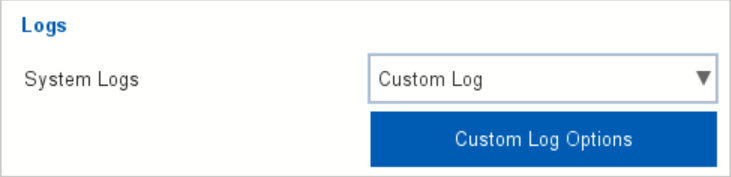
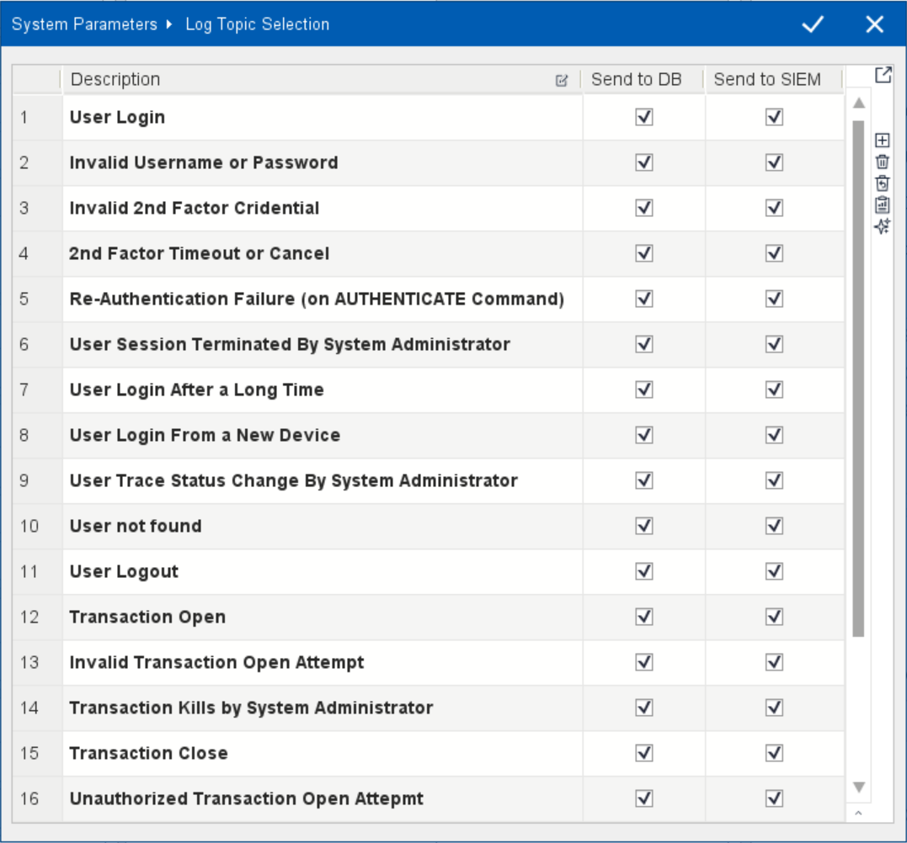

=========================================
Logging
=========================================

*TROIA Platform has an advanced logging infrastructure with various log options. This section aims to introduce all logging capabilities of the platform.*

Basics of Logging
=================

From an architectural perspective, the TROIA Platform involves two distinct logging domains. The first comprises logs related to a user's actions when attempting to connect to a specific database; examples include logging in, requesting to launch an application, or opening a document for viewing.

The second category consists of logs pertaining to the system's own infrastructure, rather than being directly linked to a specific database. Examples of such logs include server memory status and operations like shutting down or starting up the server.

This section focuses on the logs within the first domain—specifically those generated at the user level following a connection to a particular database.

Whether or not such logs are kept can be configured on a per-database basis. In other words, different logging strategies can be implemented for databases accessible via the same application server.

Log Content
-----------

This logs are stored on SYSIALOGS table on database that user requests to log in. It is also possible to pass these logs to 3rd party SIEM systems, we will discuss it under another title in this section.

The SYSIASLOGS table contains many details regarding user actions; here is the list of featured columns and their details.
::

	USERN			: username
	SESSIONID		: session id
	TRANS			: transaction
	TRANSACTIONID		: transaction id
	MESSAGE			: log content / log message
	LOGTOPIC		: lot topic
	LOGTIME			: log time as milliseconds
	CREATEDAT		: log time
	CREATEDBY		: username (similar to USERN column)
	
For the full column list of SYSIASLOGS, please see the table on "DEVT01 - System Tables" transaction.

Log Topics
============

"Log Topic" is a kind of subject id for the log. System administrators can configure log strategies topic by topic. 

All log messages inserted in the source code of the TROIA Platform contains a log topic. When the action (the subject of the log) occurs, system checks loggin configuration for the topic and decides to store or ignore the log. This confiuration also contains sending or not sending a log to SIEM systems.

Here are some log topics:

::

	User Login
	Invalid Username or Password
	Invalid 2nd Factor Cridential
	2nd Factor Timeout or Cancel
	Re-Authentication Failure (on AUTHENTICATE Command)
	User Session Terminated By System Administrator
	User Login After a Long Time
	User Login From a New Device
	User Trace Status Change By System Administrator
	User not found
	User Logout
	Transaction Open
	Invalid Transaction Open Attempt
	Transaction Close
	Unauthorized Transaction Open Attepmt
	Active Transaction Process Terminated by Administrator
	Troia Messages
	Invalid Service Call

Getting Actual List of Log Topics
---------------------------------

Most of the logs are generated internally by TROIA Platform, therefore log topics are internal. To get the actual list of log topics programmatically you can call GETLOGTOPICS() system function. This system function returns id and description of all available log topics.

Triggering this system function is not the only way to view all log topic options. It is also possible to get list on "SYS06 - System Parameters" trasanction which is used for also log configuration. This transaction also uses GETLOGTOPICS() in the background.

Log Configuration
=================

As we mentioned before it is possible to implement different logging strategies for different databases. So the main key of logging options is stored on database on ISSYSLOG column of IASSYSTEM table. This value is managed under "SYST06 - System Parameters" -> "System Logs".

In "System Logs" section on SYST06, there are some options **Closed**, **Brief**, **Detail (Transaction)**, **Detail (Transaction+Mesages)**,**Custom**. It is obvious that in "Closed" option system does not store logs. 

**Brief**, **Detail (Transaction)**, **Detail (Transaction+Mesages)** options enables some predefined log topics. Here is the available log topics for these predefined sets:

::
	
	Brief
	---------
	User Login
	User Logout
	Invalid Username/Password
	Invalid 2nd Factor Cridential
	
	Detail (Transaction)
	--------------------
	+ Brief Mode
	Transaction Open
	Invalid Transaction Open Attempt
	Transaction Close
	Unauthorized Transaction Open Attepmt
	
	Detail (Transaction+Mesages)
	---------------------------
	+ Detail (Transaction)
	TROIA Messages
	Invalid Service Call
	
Custom Log Configuration
------------------------
	
**Custom** option is only available 9.03+ canias versions. And enables more detailed logging configuration options. If you select custom option system shows "Custom Log Options" button.

   
When you click this configration button system shows configuration dialog. In this dialog it is possible to decide whether this log data will be stored on database or send to SIEM system for each log topic. So it is possible to make more detailed custom log configuration.

	

Writing Logs with TROIA
=======================

This command is avaliable on 26.10.06-01 and following builds.

::
	
	ADDLOGENTRY {message};
	ADDLOGENTRY {message} LOGLEVEL {loglevel};
	
::

	OBJECT:
		STRING LOGMESSAGE;
	
	LOGMESSAGE = 'invalid check table content';

	ADDLOGENTRY LOGMESSAGE LOGLEVEL 'ERROR';

Log Analyse Applications
========================

...log analysis application

SIEM Integration
----------------

...siem integration

