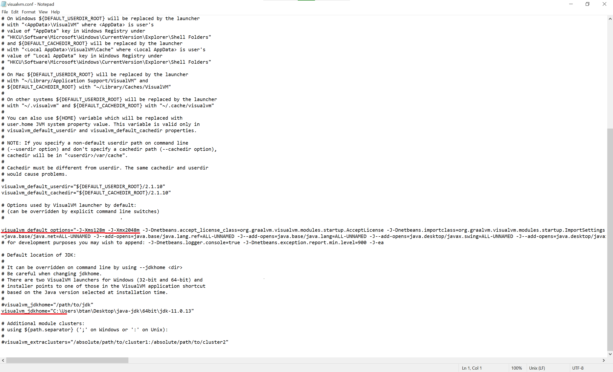

=========================================
VisualVM for Optimization and Monitoring
=========================================

Profiling Tools
-------------

A profiling tool is an optimization tool which is used to determine resource problems about components of the sofware such as which components of software consume the most resources, which functions run the longest, and which processes cause bottlenecks. 

Profiling tools focus primarily on performance analysis and memory management, because the primary bottleneck resources in a software systems are the CPU and memory. So in generalprofiling tools generally do not focus on resources such as disk or network.

Performance and memory analysis are performed to detect and resolve various errors or to optimize problematic parts of the code in terms of processor and memory usage. All profiling tools work for these purposes, however, they vary according to the characteristics and needs of the programming language or platform.

Performance (CPU) Analysis
==========================

Performance analysis is the whole analysis process based on the running time, such as the triggering order of functions within the application, the number of triggers, and the time spent in these functions. It measures the speed of the application and determine its efficiency in terms of processing load.

Memory Analaysis
================

Memory Analysis is the analysis process carried out to measure the memory usage of the application, examine the data held in memory, and detect unnecessary memory usage or memory leaks.

What is VisualVM?
-----------------

Java applications run on a virtual machine called the "Java Virtual Machine" (JVM), which provides a platform-independent runtime environment for Java programs. It provides many tools for analyzing and using applications running on it.

VisualVM is a profiling tool used to monitor and analyze applications running on the JVM. Structurally, it offers a user-friendly interface with all the profiling tools offered by the JVM. Since it offers some limited features in terms of monitoring, it can also be used as a monitoring tool when needed.

Main Functionalities of VisualVM
================================

It is possible to perform the following operations on VisualVM:

- Monitoring application's CPU and memory usage data in real time
- Monitoring threads on the application and their status
- Analysing which class functions consume more CPU
- Take a dump of the class instances in memory
- Analyzing memory/heap dumps
- Trigger the Garbage Collector operation or watch the moments when it is automatically triggered

Alternative Tools
=================

As an alternative to VisualVM, YourKit is one of the most common and professional options. Other solutions such as JProfiler or Java Mission Control can also be considered as alternatives.

How to run VisualVM?
-----------------

First, you should download VisualVM from https://visualvm.github.io/. After opening the compressed folder you downloaded, you can run the \bin\visalvm.exe file in this folder. For other operating systems, you need to follow the necessary instructions according to the structure of your system.

Yapılacak incelemeye niteliğine göre VisualVM başlatılırken, bellek parametrelerini ve VisualVM’in çalışacağı JDK path’ini de konfigüre etmek gerekebilir. Bunun için \etc\visualvm.conf dosyası içindeki ilgili parametreleri ihtiyaçlarınıza göre düzenlemelisiniz. Bu configrürasyon dosyası içindeki önemli parametreler, visualvm_default_options ve visualvm_jdkhome parametreleridir. Diğer parametreler için VisualVM dokümantasyonunu inceleyiniz.

   
For the same purpose you can also enter -J<jvm_option> and --jdkhome parameters to the application while running VisualVM without changing the configuration file. Further, many operations can be performed via the interface with the VisualVM command line tools, and thus processes can be automated. You can examine the other VisualVM parameters by running the visualvm –help command in the folder where the VisualVM application is located. 

The screen that appears when the application is running has two basic components. The first of these is the left section, which shows the running JVMs, snapshots or heapdumps. The other is the second section, which shows the status of the connected JVM or the operations to be performed on this JVM. When the application is first opened, the splash screen or a blank screen will appear because there is no connected JVM yet.

It is also possible to connect to a remote JVM via VisualVM. In this document, we will focus only on operating on a locally running JVM.
   

How to connect to the JVM to be examined?
=========================================

In order to analyze your application, you must first connect to a JVM via VisualVM. To do this, you need to double-click on the application you want to analyze by selecting it from the local JVMs on the first left side of VisualVM.

If multiple instances of the same application are running on the operating system, you must ensure that you are connecting to the correct JVM. To do this, you need to know the name or process ID (pid) of your application. You can find this in the task manager. If you cannot see the PID of your application in the task manager, you can also make this column visible and access this data.

   
After connecting to the correct JVM instance, a screen opens on the right side that provides basic information for that JVM. In the data here, it is possible to see the configuration that will affect the system as a whole, such as java home, JVM version, JVM arguments and System properties.

The critical -Xms and -Xmx parameters are also listed here within the JVM Parameters. This screen can be used to check whether all critical parameters are reflected in the JVM as planned.

How to monitor CPU and Memory Usage?
------------------------------------

After connecting to the JVM, if you switch from Overview to the Monitor tab, you can monitor some cpu and memory info about connected JVM. There are some simple and useful information on this tab such as JVM uptime, CPU and memory consumption instantly via graphical interfaces. In this screen, it is also possible to graphically monitor the number of threads and the number of loaded classes in the system at that moment.

   
Additionly, by triggering the Garbage Collector on the Monitor tab, unused class instances that are in memory can be cleared from memory. This process is an operation carried out by the JVM under normal conditions. However, when analyzing situations that are temporarily used for a process but are expected to be released later on the application, the Garbage Collector may need to be run manually. In other words, this tool can be used when investigating possible memory leak problems.

What is HeapDump?
-----------------

One of the operations that can be done via the Monitor tab is to take a Heap Dump. Heap is the memory area allocated to an application during its operation and used dynamically by the application. When the Heap Dump button is pressed, all classes and their contents in the heap memory area are written to a file. This data includes almost everything currently in memory, and various analyses can be conducted on this data according to the target.

When you create a heap dump, this heap dump appears with the time information under the server you are connected to. When you double-click it and open it, system firstly opens a summary of the data collected about the memory and application at the time the heap dump was taken.

   
On this summary screen, if you select the "objects" option, you can see a list of all objects currently in memory. On this Objects screen, you can view the objects that use the most space in memory or all objects. Using the filters at the bottom of the page, the results can be filtered based on class or package name.

On this screen, you can view object count, consumed memory space, subfields of objects for each sample and the values ​​of these objects and their fields. **In this context, it is important to note that a heap dump data taken from a live environment poses information security risks.**

When the heap dump is generated and examined, you will realize that the "retained size" information is not calculated at the first stage. Retained size refers to the amount of memory occupied by an object and its references, considering its relationships with other objects in the memory heap. In other words, when an object is deleted from memory, it determines whether all objects that directly or indirectly reference this object will also be deleted from memory.

	