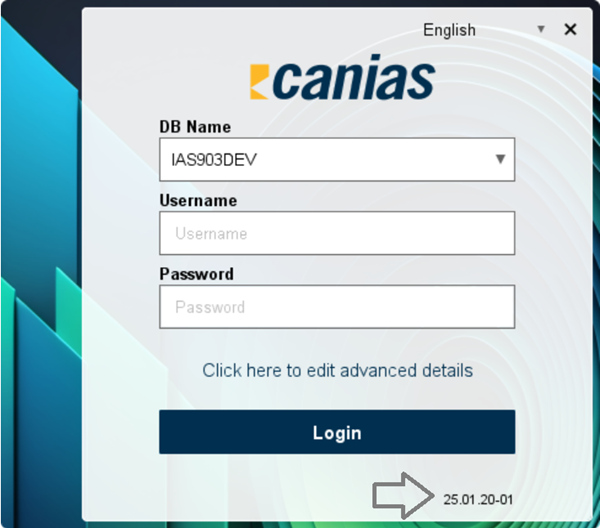
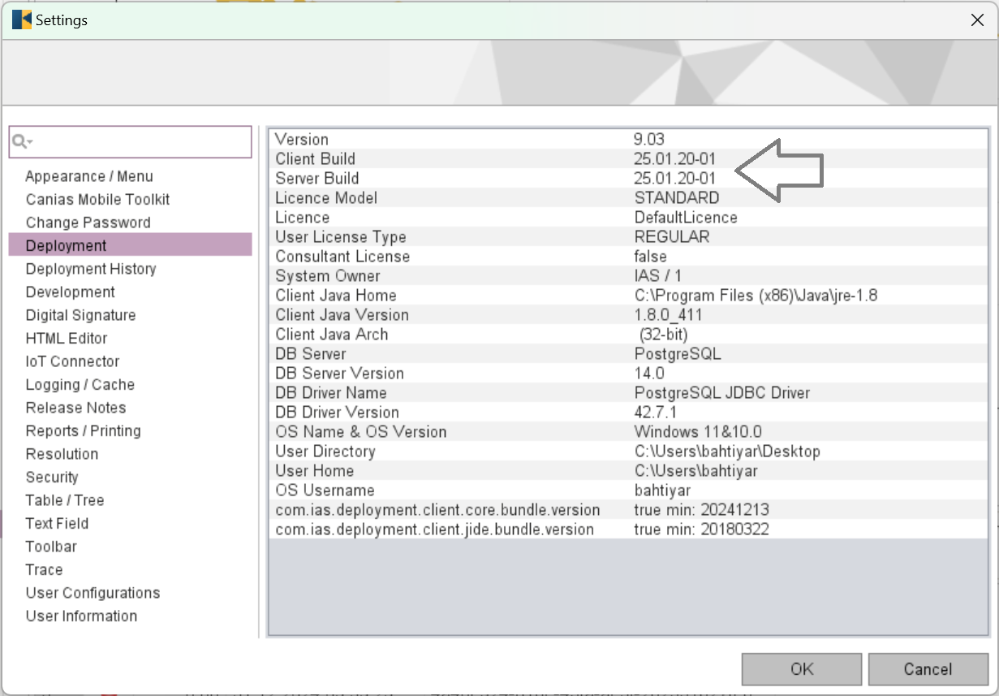

=========================================
Appendix III - Frequently Asked Questions
=========================================

*TROIA Platform and TROIA Programming Language are huge tools, so there are too many challenging points. This section aims to give useful and practical responses to frequently asked questions to make you save time.*

Question: What is my build number?
----------------------------------

As an TROIA application developer or system administrator, it is important to know your build number. Because some new features revealed or bugs are fixed with new releases. And you must know whether your build supports the features that you need. For a valid deployment all TROIA platform components must have same build number.

First method that you can read your build number on login screen or from about dialog 

   

If you are aready logged in you can view your client and server build numbers from **Settings->Deployment** . At this tab you can also get some other useful information about your deployment.

   
   
602, 603, 604, 802, 803 are names **CANIAS ERP** versions and all are designed to run on a major TROIA Platform build. (602 works on 3.08.xx xxxxxx, 603 works on 5.01.xx xxxxxx, 604 works on 5.02.xx xxxxxx, 802 works on 8.02 YY.MM.DD-NN, 803 works on 8.03 YY.MM.DD-NN). So; 602, 603, 604, 802, 803 are not valid build names for TROIA Platform. 

**After 23.02.10-01 builds, TROIA Platform supports 8.02, 8.03, 9.03 versions of CANIAS ERP.**

Question: Division of Integers
------------------------------

When dividing integers, the result depends on the data types of the numbers involved. Since both dividend and divisor are integers, TROIA performs integer division and discards the decimal portion as in Java.

::

	OBJECT:
		DECIMAL RESULT;

	RESULT = 1   / 2;     // result is 0    (not 0.05)
	RESULT = 1.0 / 2;   // result is 0.5
	RESULT = 1   / 2.0;   // 0.5

To get a decimal result, at least one of the numbers must be a DECIMAL. Please review the sample code above. 
In this example dividend and divisor are hard coded, behaviour is same when these are integer variables. 

