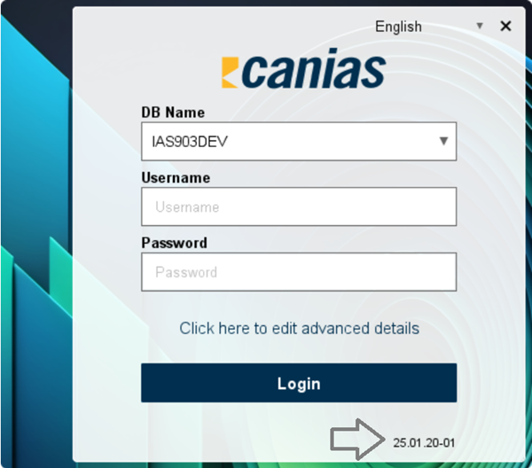
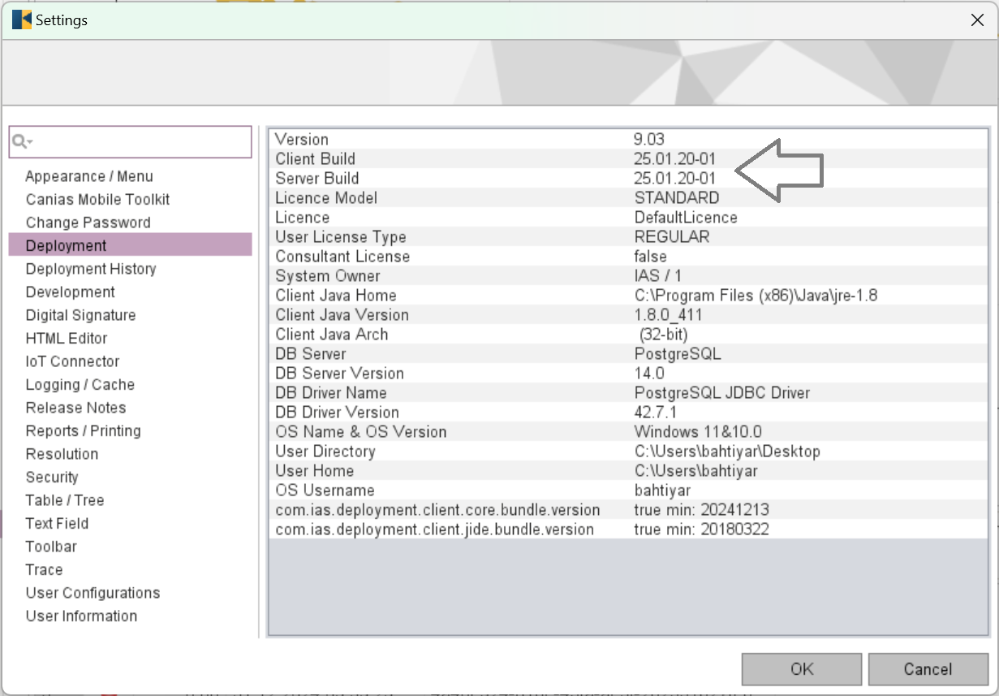

========================================
Appendix IV - Frequently Asked Questions
========================================

*TROIA Platform and TROIA Programming Language are huge tools, so there are too many challenging points. This section aims to give useful and practical responses to frequently asked questions to make you save time.*

How to read build number?
---------------------------

As an TROIA application developer or system administrator, it is important to know your build number. Because some new features revealed or bugs are fixed with new releases. And you must know whether your build supports the features that you need. For a valid deployment all TROIA platform components must have same build number.

First method that you can read your build number on login screen or from about dialog 

   

If you are aready logged in you can view your client and server build numbers from Settings->Deployment. At this tab you can also get some other useful information about your deployment.

